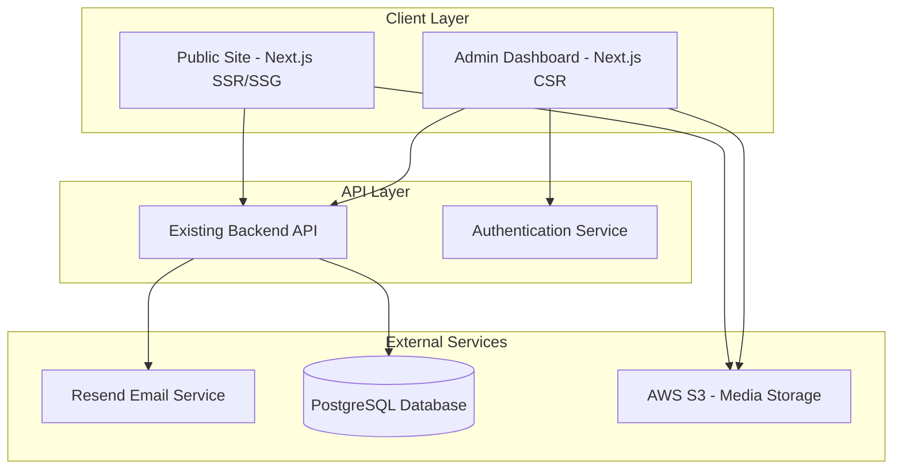

# Design Document

## Overview

The Cook Smart Website is a modern, performant web platform built with Next.js 14, featuring a public-facing marketing site and a secure admin dashboard. The architecture prioritizes SEO, performance, and scalability while maintaining budget consciousness through strategic use of free-tier services and serverless deployment. The system integrates with the existing Cook Smart backend API and leverages Resend for email communications.

## Architecture

### High-Level Architecture



### Technology Stack

**Frontend:**
- Next.js 14 (App Router)
- React 18
- TypeScript
- Tailwind CSS
- Shadcn/ui components
- React Query (data fetching)
- Zustand (state management)

**Backend Integration:**
- Existing Node.js/Express API
- PostgreSQL database
- JWT authentication

**Email:**
- Resend API
- React Email templates

**Hosting & Deployment:**
- Vercel (free tier for public site)
- AWS S3 (media storage)
- CloudFront CDN (optional, for performance)

**Analytics & Monitoring:**
- Vercel Analytics (free)
- Google Analytics 4
- Sentry (error tracking - free tier)

## Components and Interfaces

### Public Site Components

#### 1. Homepage Component
- Hero section with app showcase
- Feature highlights grid
- Testimonials carousel
- Download CTA sections
- Newsletter signup form

#### 2. Recipe Showcase Component
- Recipe grid with infinite scroll
- Search and filter interface
- Recipe detail modal/page
- Social sharing buttons

#### 3. Blog Component
- Article list with pagination
- Article detail page with rich content
- Category filtering
- Related posts section
- SEO-optimized metadata

#### 4. Interactive Demo Component
- Meal planner calendar view
- Recipe selection interface
- Sample grocery list generator
- Download CTA overlay

#### 5. Contact Form Component
- Form validation
- Resend integration
- Success/error messaging
- Admin notification trigger

### Admin Dashboard Components

#### 1. Authentication Components
- Login form with JWT handling
- Session management
- Role-based access control
- Auto-logout on inactivity

#### 2. User Management Components
- User table with search/filter
- User detail view
- Account modification forms
- Activity history timeline

#### 3. Content Moderation Components
- Flagged content queue
- Content review interface
- Approval/rejection actions
- Moderation history log

#### 4. Analytics Dashboard Components
- Metric cards (KPIs)
- Chart components (Line, Bar, Pie)
- Date range selector
- Export functionality

#### 5. Recipe Management Components
- Recipe table with filters
- Recipe editor
- Feature toggle
- Bulk action interface

#### 6. Email Campaign Components
- Template editor
- User segmentation selector
- Campaign scheduler
- Performance metrics

#### 7. System Monitoring Components
- Health status indicators
- Performance metrics charts
- Error log viewer
- Alert configuration

## Data Models

### Frontend Data Models

```typescript
interface User {
  id: string;
  email: string;
  name: string;
  role: 'user' | 'admin' | 'super_admin';
  isActive: boolean;
  createdAt: Date;
  lastLoginAt: Date;
}

interface Recipe {
  id: string;
  title: string;
  description: string;
  imageUrl: string;
  ingredients: Ingredient[];
  instructions: string[];
  cookingTime: number;
  servings: number;
  nutritionalInfo: NutritionalInfo;
  author: User;
  isFeatured: boolean;
  isFlagged: boolean;
  status: 'draft' | 'published' | 'archived';
  createdAt: Date;
  updatedAt: Date;
}

interface BlogPost {
  id: string;
  title: string;
  slug: string;
  excerpt: string;
  content: string;
  featuredImage: string;
  author: string;
  categories: string[];
  tags: string[];
  publishedAt: Date;
  isPublished: boolean;
  seoMetadata: SEOMetadata;
}

interface AdminUser {
  id: string;
  email: string;
  name: string;
  role: 'admin' | 'super_admin';
  permissions: Permission[];
  isActive: boolean;
  createdAt: Date;
  lastLoginAt: Date;
}

interface SupportTicket {
  id: string;
  userId: string;
  subject: string;
  message: string;
  status: 'open' | 'in_progress' | 'resolved' | 'closed';
  priority: 'low' | 'medium' | 'high' | 'urgent';
  assignedTo: string | null;
  conversation: Message[];
  createdAt: Date;
  resolvedAt: Date | null;
}

interface EmailCampaign {
  id: string;
  name: string;
  subject: string;
  templateId: string;
  targetSegment: UserSegment;
  scheduledAt: Date | null;
  sentAt: Date | null;
  status: 'draft' | 'scheduled' | 'sent' | 'cancelled';
  metrics: {
    sent: number;
    opened: number;
    clicked: number;
    bounced: number;
  };
}

interface AnalyticsMetric {
  name: string;
  value: number;
  change: number;
  trend: 'up' | 'down' | 'stable';
  period: string;
}
```

## C
orrectness Properties

*A property is a characteristic or behavior that should hold true across all valid executions of a system-essentially, a formal statement about what the system should do. Properties serve as the bridge between human-readable specifications and machine-verifiable correctness guarantees.*

### Public Site Properties

Property 1: Platform-specific download redirects
*For any* device user agent, clicking a download button should redirect to the correct app store (Google Play for Android, App Store for iOS)
**Validates: Requirements 1.3**

Property 2: Responsive design adaptation
*For any* viewport size, the page should render correctly with appropriate layouts for mobile, tablet, and desktop breakpoints
**Validates: Requirements 1.4**

Property 3: Recipe grid completeness
*For any* featured recipe displayed in the grid, it should include an image, title, and brief description
**Validates: Requirements 2.1**

Property 4: Recipe detail completeness
*For any* recipe detail view, it should display ingredients, instructions, cooking time, and nutritional information
**Validates: Requirements 2.2**

Property 5: Approved content filtering
*For any* recipe query, the results should only include recipes that are approved and not flagged
**Validates: Requirements 2.3**

Property 6: Recipe search filtering
*For any* search query with keywords, ingredients, or dietary preferences, the results should only include recipes matching the criteria
**Validates: Requirements 2.4**

Property 7: Recipe pagination
*For any* recipe collection exceeding the page size, the system should implement pagination or infinite scroll correctly
**Validates: Requirements 2.5**

Property 8: Content categorization
*For any* resource article, it should be assigned to at least one category and displayed in the correct category section
**Validates: Requirements 3.1**

Property 9: Content search functionality
*For any* search query in resources, the results should match the search criteria and filters
**Validates: Requirements 3.2**

Property 10: Related content suggestions
*For any* article viewed, the system should display related content suggestions based on category or tags
**Validates: Requirements 3.3**

Property 11: SEO metadata completeness
*For any* published content, it should include title, description, and Open Graph tags for SEO
**Validates: Requirements 3.4**

Property 12: Social sharing metadata
*For any* shareable content, the sharing buttons should include proper Open Graph tags for preview generation
**Validates: Requirements 3.5**

Property 13: Blog post completeness
*For any* blog post in the list, it should display featured image, title, excerpt, and publication date
**Validates: Requirements 4.1**

Property 14: Blog detail completeness
*For any* blog post detail view, it should include proper formatting, images, and author information
**Validates: Requirements 4.2**

Property 15: Blog post elements
*For any* displayed blog post, it should include category tags, related posts, and social sharing buttons
**Validates: Requirements 4.3**

Property 16: Blog search filtering
*For any* blog search query, the results should match keywords, categories, or tags
**Validates: Requirements 4.4**

Property 17: RSS and sitemap updates
*For any* newly published content, the RSS feed and sitemap should be updated to include the new content
**Validates: Requirements 4.5**

Property 18: Testimonial completeness
*For any* displayed testimonial, it should include photo, name, and story
**Validates: Requirements 5.1**

Property 19: Testimonial metrics
*For any* testimonial, it should include at least one metric (time saved, meals cooked, or money saved)
**Validates: Requirements 5.2**

Property 20: Testimonial filtering
*For any* filter criteria (goals, dietary preferences, skill level), the testimonials should be correctly filtered
**Validates: Requirements 5.3**

Property 21: Video testimonial controls
*For any* video testimonial, it should render with proper video player controls
**Validates: Requirements 5.4**

Property 22: Testimonial submission routing
*For any* testimonial submission, it should be routed to the admin dashboard for approval
**Validates: Requirements 5.5**

Property 23: Demo state updates
*For any* recipe added to the demo planner, the calendar view and grocery list should update accordingly
**Validates: Requirements 6.2**

Property 24: Demo functionality limits
*For any* demo interaction, the system should restrict functionality to showcase features without requiring authentication
**Validates: Requirements 6.3**

Property 25: FAQ categorization
*For any* FAQ item, it should be assigned to a category and displayed in the correct section
**Validates: Requirements 7.1**

Property 26: FAQ search and highlighting
*For any* FAQ search query, matching questions should be filtered and matching text highlighted
**Validates: Requirements 7.2**

Property 27: FAQ organization
*For any* FAQ display, questions should be organized by predefined categories
**Validates: Requirements 7.3**

Property 28: FAQ timestamp updates
*For any* FAQ update, the last-updated timestamp should be set to the current time
**Validates: Requirements 7.5**

Property 29: Email validation and storage
*For any* email entered in a signup form, it should be validated and stored if valid
**Validates: Requirements 8.1**

Property 30: Newsletter confirmation email
*For any* successful subscription, a confirmation email with welcome message and unsubscribe option should be sent
**Validates: Requirements 8.2**

Property 31: Email service integration
*For any* newsletter subscription, it should be synced with the email marketing service
**Validates: Requirements 8.4**

Property 32: Subscription preferences
*For any* subscriber, they should be able to manage email frequency and content type preferences
**Validates: Requirements 8.5**

### Admin Dashboard Properties

Property 33: Authentication with valid credentials
*For any* valid admin credentials submitted, the system should authenticate and create a secure session
**Validates: Requirements 9.2**

Property 34: Authentication failure handling
*For any* invalid credentials submitted, the system should display an error and prevent dashboard access
**Validates: Requirements 9.3**

Property 35: Logout session clearing
*For any* logout action, the system should clear the session and redirect to login
**Validates: Requirements 9.5**

Property 36: User table functionality
*For any* user management view, the table should support search and sorting across all user fields
**Validates: Requirements 10.1**

Property 37: User search filtering
*For any* user search query, results should be filtered by name, email, registration date, or account status
**Validates: Requirements 10.2**

Property 38: User detail completeness
*For any* user detail view, it should display activity history, recipes created, and account status
**Validates: Requirements 10.3**

Property 39: User modification logging
*For any* user account modification, the change should persist to the database and be logged with admin identity
**Validates: Requirements 10.4**

Property 40: User deactivation enforcement
*For any* deactivated user, they should be prevented from accessing the mobile app
**Validates: Requirements 10.5**

Property 41: Moderation queue display
*For any* flagged content, it should appear in the moderation queue with flag details
**Validates: Requirements 11.1**

Property 42: Flagged content details
*For any* flagged content review, the system should display content details, flag reason, and reporter information
**Validates: Requirements 11.2**

Property 43: Content approval workflow
*For any* approved content, the flag should be removed and content made visible
**Validates: Requirements 11.3**

Property 44: Content removal workflow
*For any* removed content, it should be hidden from public view and creator notified
**Validates: Requirements 11.4**

Property 45: Moderation audit logging
*For any* moderation action, it should be logged with timestamp and administrator identity
**Validates: Requirements 11.5**

Property 46: Analytics metrics display
*For any* analytics view, it should display active users, new registrations, recipe views, and app downloads
**Validates: Requirements 12.1**

Property 47: Analytics filtering
*For any* date range filter applied, metrics should be recalculated for that period
**Validates: Requirements 12.2**

Property 48: Analytics drill-down
*For any* metric selected, detailed breakdowns with charts should be displayed
**Validates: Requirements 12.3**

Property 49: Analytics data refresh
*For any* data refresh action, updated statistics should be fetched from the backend API
**Validates: Requirements 12.4**

Property 50: Analytics export
*For any* export request, the system should generate downloadable reports in CSV or PDF format
**Validates: Requirements 12.5**

Property 51: Settings display completeness
*For any* settings view, each option should display current value, default value, and description
**Validates: Requirements 13.5**

Property 52: Settings validation and persistence
*For any* setting modification, the input should be validated and persisted to the backend
**Validates: Requirements 13.2**

Property 53: Settings change application
*For any* setting change, it should be applied immediately or scheduled based on setting type
**Validates: Requirements 13.3**

Property 54: Critical settings confirmation
*For any* critical setting modification, confirmation should be required and change logged
**Validates: Requirements 13.4**

Property 55: Admin list display
*For any* admin management view, all administrators with roles and permissions should be displayed
**Validates: Requirements 14.1**

Property 56: Admin account creation
*For any* admin access grant, an account should be created with specified permissions and welcome email sent
**Validates: Requirements 14.2**

Property 57: Admin permission updates
*For any* admin permission modification, the role should update immediately and change logged
**Validates: Requirements 14.3**

Property 58: Admin access revocation
*For any* admin access revocation, the account should be disabled and all sessions terminated
**Validates: Requirements 14.4**

Property 59: Role-based access control
*For any* admin login, access should be enforced based on assigned permissions
**Validates: Requirements 14.5**

Property 60: Notification creation options
*For any* notification creation, options for content, target audience, and timing should be provided
**Validates: Requirements 15.1**

Property 61: Notification scheduling
*For any* scheduled notification, it should be stored and delivered at the specified time
**Validates: Requirements 15.2**

Property 62: Notification targeting
*For any* notification sent, it should support targeting by user segments, activity level, or location
**Validates: Requirements 15.3**

Property 63: Notification tracking
*For any* sent notification, delivery status and engagement metrics should be tracked
**Validates: Requirements 15.4**

Property 64: Notification history display
*For any* notification history view, past messages with delivery statistics should be displayed
**Validates: Requirements 15.5**

Property 65: SEO metadata presence
*For any* page, proper meta tags, structured data, and sitemap entries should be present
**Validates: Requirements 16.2**

Property 66: Image optimization
*For any* displayed image, it should use optimized formats with lazy loading and responsive sizing
**Validates: Requirements 16.3**

Property 67: SSR/SSG implementation
*For any* critical content page, server-side rendering or static generation should be implemented
**Validates: Requirements 16.5**

Property 68: Contact form validation
*For any* contact form submission, inputs should be validated before sending
**Validates: Requirements 17.2**

Property 69: Contact form success workflow
*For any* successful form submission, a confirmation message should display and auto-reply email sent
**Validates: Requirements 17.3**

Property 70: Support request logging
*For any* support request received, it should be logged in the admin dashboard
**Validates: Requirements 17.5**

Property 71: Recipe management filtering
*For any* recipe management view, recipes should be filterable by status, rating, views, and creation date
**Validates: Requirements 18.1**

Property 72: Recipe detail actions
*For any* selected recipe, options to edit, feature, or remove should be available
**Validates: Requirements 18.2**

Property 73: Recipe featuring
*For any* featured recipe, it should be marked for display on public website homepage and showcase
**Validates: Requirements 18.3**

Property 74: Recipe edit logging
*For any* recipe edit, the content should update and modification logged with admin identity
**Validates: Requirements 18.4**

Property 75: Recipe bulk operations
*For any* bulk recipe operation, batch approval, categorization, or deletion should be supported
**Validates: Requirements 18.5**

Property 76: Activity monitor display
*For any* activity monitor view, real-time sessions, active users, and app usage should be displayed
**Validates: Requirements 19.1**

Property 77: Engagement metrics display
*For any* engagement analysis, metrics for recipe views, saves, shares, and completion rates should be shown
**Validates: Requirements 19.2**

Property 78: User behavior analysis
*For any* behavior review, cohort analysis, retention rates, and churn predictions should be provided
**Validates: Requirements 19.3**

Property 79: Anomaly highlighting
*For any* issue identification, anomalies like error spikes or unusual patterns should be highlighted
**Validates: Requirements 19.4**

Property 80: Activity data export
*For any* activity export request, detailed reports with customizable date ranges should be generated
**Validates: Requirements 19.5**

Property 81: Financial dashboard display
*For any* financial dashboard view, revenue metrics, subscription counts, and payment trends should be displayed
**Validates: Requirements 20.1**

Property 82: Subscription list display
*For any* subscription review, active, cancelled, and trial subscriptions with renewal dates should be shown
**Validates: Requirements 20.2**

Property 83: Payment failure flagging
*For any* payment issue, failed payments should be flagged with tools to contact affected users
**Validates: Requirements 20.3**

Property 84: Refund processing
*For any* refund request, it should be processed through the payment gateway and user status updated
**Validates: Requirements 20.4**

Property 85: Financial report export
*For any* financial report generation, data should be exported with transaction details and tax information
**Validates: Requirements 20.5**

Property 86: Support ticket queue display
*For any* support dashboard view, open tickets should be organized by priority, status, and age
**Validates: Requirements 21.1**

Property 87: Ticket detail completeness
*For any* opened ticket, conversation history, user details, and related issues should be shown
**Validates: Requirements 21.2**

Property 88: Ticket response workflow
*For any* ticket response, it should be sent to the user via email and ticket status updated
**Validates: Requirements 21.3**

Property 89: Ticket closure requirements
*For any* ticket closure, a resolution note should be required and user feedback optionally requested
**Validates: Requirements 21.4**

Property 90: Support trend analysis
*For any* support trend analysis, reports on common issues, response times, and resolution rates should be generated
**Validates: Requirements 21.5**

Property 91: Version dashboard display
*For any* version management view, all app versions with adoption rates and crash statistics should be displayed
**Validates: Requirements 22.1**

Property 92: Feature flag management
*For any* feature flag, toggles should enable or disable features for specific user segments or versions
**Validates: Requirements 22.2**

Property 93: Emergency feature control
*For any* critical bug, the system should allow forcing updates or disabling problematic features
**Validates: Requirements 22.3**

Property 94: Gradual rollout support
*For any* new feature rollout, percentage-based user targeting should be supported
**Validates: Requirements 22.4**

Property 95: Version monitoring alerts
*For any* version monitoring, alerts should trigger when old versions exceed usage thresholds
**Validates: Requirements 22.5**

Property 96: Blog editor functionality
*For any* blog post creation, a rich text editor with image upload, formatting, and preview should be provided
**Validates: Requirements 23.1**

Property 97: Content scheduling
*For any* content scheduling, publication dates, expiration dates, and featured status should be settable
**Validates: Requirements 23.2**

Property 98: Media library management
*For any* media management, a library for organizing images, videos, and resources should be provided
**Validates: Requirements 23.3**

Property 99: Publishing workflow automation
*For any* content publication, sitemaps, RSS feeds, and social media previews should be automatically updated
**Validates: Requirements 23.4**

Property 100: Content performance analytics
*For any* content performance review, analytics for views, engagement, and conversion rates should be displayed
**Validates: Requirements 23.5**

Property 101: Email campaign editor
*For any* email campaign creation, a template editor with drag-and-drop components and preview should be provided
**Validates: Requirements 24.1**

Property 102: User segmentation
*For any* user targeting, segmentation by activity level, subscription status, location, or custom criteria should be allowed
**Validates: Requirements 24.2**

Property 103: Campaign scheduling options
*For any* campaign scheduling, immediate sending, scheduled delivery, or automated triggers should be supported
**Validates: Requirements 24.3**

Property 104: Campaign tracking
*For any* sent campaign, open rates, click rates, and conversion metrics should be tracked
**Validates: Requirements 24.4**

Property 105: Template library management
*For any* template management, a library of reusable email templates should be maintained
**Validates: Requirements 24.5**

Property 106: System health display
*For any* system health dashboard view, API response times, error rates, and server resource usage should be displayed
**Validates: Requirements 25.1**

Property 107: Performance monitoring
*For any* performance monitoring, database query performance, cache hit rates, and third-party API status should be shown
**Validates: Requirements 25.2**

Property 108: Issue alerting
*For any* detected issue, alerts should be sent via email or SMS for critical errors or performance degradation
**Validates: Requirements 25.3**

Property 109: Log viewer functionality
*For any* log review, searchable error logs with filtering by severity, timestamp, and component should be provided
**Validates: Requirements 25.4**

Property 110: Trend analysis display
*For any* trend analysis, historical performance data with comparison tools should be displayed
**Validates: Requirements 25.5**

Property 111: Security dashboard display
*For any* security dashboard view, recent login attempts, failed authentications, and suspicious activities should be displayed
**Validates: Requirements 26.1**

Property 112: Audit log completeness
*For any* audit log review, all administrative actions with timestamps, user identity, and affected resources should be shown
**Validates: Requirements 26.2**

Property 113: Security incident investigation
*For any* security incident investigation, detailed logs of user actions, IP addresses, and device information should be provided
**Validates: Requirements 26.3**

Property 114: Threat detection and blocking
*For any* detected security threat, suspicious patterns should be flagged and blocking capabilities provided
**Validates: Requirements 26.4**

Property 115: Audit data export
*For any* audit data export, compliance-ready reports for security audits should be generated
**Validates: Requirements 26.5**

Property 116: Deep link app opening
*For any* mobile user clicking a recipe link with the app installed, the Cook Smart app should open with the specific recipe
**Validates: Requirements 27.1**

Property 117: Deep link fallback
*For any* mobile user without the app installed, they should be redirected to mobile web or app store
**Validates: Requirements 27.2**

Property 118: Deep link parameter passing
*For any* triggered deep link, relevant parameters should be passed to the app for proper navigation
**Validates: Requirements 27.4**

Property 119: Deep link error handling
*For any* failed deep link, the system should gracefully fall back to web experience without errors
**Validates: Requirements 27.5**

## Error Handling

### Client-Side Error Handling

**Network Errors:**
- Implement retry logic with exponential backoff for failed API requests
- Display user-friendly error messages for network failures
- Cache critical data locally for offline resilience
- Provide fallback UI states for loading and error conditions

**Validation Errors:**
- Validate all form inputs on client-side before submission
- Display inline validation errors with clear messaging
- Prevent submission of invalid data
- Provide helpful hints for correct input format

**Authentication Errors:**
- Handle expired sessions gracefully with automatic redirect to login
- Clear sensitive data from local storage on logout
- Implement token refresh mechanism for seamless user experience
- Display clear messages for authentication failures

**Component Errors:**
- Implement React Error Boundaries to catch rendering errors
- Log errors to monitoring service (Sentry)
- Display fallback UI for broken components
- Provide recovery actions where possible

### Server-Side Error Handling

**API Integration Errors:**
- Handle backend API failures with appropriate fallbacks
- Implement circuit breaker pattern for failing services
- Log all API errors with context for debugging
- Return meaningful error responses to client

**Email Service Errors:**
- Queue failed emails for retry
- Log email delivery failures
- Provide admin notifications for critical email failures
- Implement fallback email providers if needed

**Database Errors:**
- Handle connection failures gracefully
- Implement query timeouts
- Log database errors with query context
- Provide meaningful error messages without exposing internals

## Testing Strategy

### Unit Testing

**Component Testing:**
- Test all React components in isolation
- Mock external dependencies (API calls, routing)
- Test component rendering with various props
- Test user interactions and event handlers
- Verify accessibility compliance

**Utility Function Testing:**
- Test data transformation functions
- Test validation logic
- Test formatting functions
- Test error handling paths

**API Integration Testing:**
- Test API client functions
- Mock API responses for various scenarios
- Test error handling for failed requests
- Test authentication token management

### Property-Based Testing

**Testing Framework:** fast-check (JavaScript/TypeScript property-based testing library)

**Configuration:** Each property-based test should run a minimum of 100 iterations to ensure thorough coverage of the input space.

**Test Tagging:** Each property-based test must include a comment tag in the following format:
```typescript
// **Feature: cook-smart-website, Property {number}: {property_text}**
```

**Property Test Implementation:**
- Each correctness property listed above should be implemented as a single property-based test
- Tests should generate random valid inputs within the domain constraints
- Tests should verify the property holds across all generated inputs
- Failed tests should provide clear counterexamples for debugging

**Example Property Test:**
```typescript
// **Feature: cook-smart-website, Property 3: Recipe grid completeness**
test('recipe grid displays complete information for all recipes', () => {
  fc.assert(
    fc.property(
      fc.array(recipeGenerator(), { minLength: 1, maxLength: 50 }),
      (recipes) => {
        const grid = renderRecipeGrid(recipes);
        return recipes.every(recipe => 
          grid.includes(recipe.image) &&
          grid.includes(recipe.title) &&
          grid.includes(recipe.description)
        );
      }
    ),
    { numRuns: 100 }
  );
});
```

### Integration Testing

**End-to-End Testing:**
- Test critical user flows (signup, login, content viewing)
- Test admin workflows (user management, content moderation)
- Test email delivery workflows
- Test payment processing workflows
- Use Playwright or Cypress for browser automation

**API Integration Testing:**
- Test integration with existing backend API
- Test authentication flows
- Test data synchronization
- Test error handling for API failures

### Performance Testing

**Lighthouse Audits:**
- Run Lighthouse audits on all public pages
- Ensure performance scores meet requirements (90+ desktop, 80+ mobile)
- Monitor and optimize Core Web Vitals
- Test on various network conditions

**Load Testing:**
- Test admin dashboard with large datasets
- Test concurrent user scenarios
- Identify performance bottlenecks
- Optimize database queries and API calls

### Security Testing

**Authentication Testing:**
- Test JWT token validation
- Test session management
- Test role-based access control
- Test password reset flows

**Input Validation Testing:**
- Test for SQL injection vulnerabilities
- Test for XSS vulnerabilities
- Test for CSRF protection
- Test file upload security

**Security Headers Testing:**
- Verify HTTPS enforcement
- Verify security headers (CSP, HSTS, etc.)
- Test for information disclosure
- Test for clickjacking protection

## Deployment Strategy

### Phased Rollout

**Phase 1: Public Site MVP**
- Homepage with hero and features
- Recipe showcase (read-only)
- Basic contact form
- SEO optimization
- Deploy to Vercel free tier

**Phase 2: Admin Dashboard Core**
- Authentication and user management
- Content moderation tools
- Basic analytics dashboard
- Recipe management

**Phase 3: Content Marketing**
- Blog functionality
- Newsletter signup
- Email integration with Resend
- FAQ and help center

**Phase 4: Advanced Admin Features**
- Financial management
- Support ticketing
- System monitoring
- Security and audit logs

**Phase 5: Advanced Features**
- Interactive demo
- Email campaigns
- Feature flags
- Advanced analytics

### Continuous Deployment

**Development Workflow:**
- Feature branches for new development
- Pull requests with code review
- Automated testing on PR
- Merge to main triggers deployment

**Deployment Pipeline:**
- Vercel automatic deployments from Git
- Preview deployments for PRs
- Production deployment on main branch merge
- Automatic rollback on deployment failures

**Monitoring:**
- Vercel Analytics for performance monitoring
- Sentry for error tracking
- Google Analytics for user behavior
- Custom logging for admin actions

## Budget Considerations

### Free Tier Services

**Hosting:**
- Vercel: Free tier (100GB bandwidth, unlimited deployments)
- Cost: $0/month

**Email:**
- Resend: Free tier (3,000 emails/month, 100/day)
- Cost: $0/month (sufficient for beta phase)

**Database:**
- Existing PostgreSQL on AWS RDS
- Cost: Already covered by existing infrastructure

**Media Storage:**
- AWS S3: Free tier (5GB storage, 20,000 GET requests)
- Cost: $0-5/month depending on usage

**Monitoring:**
- Vercel Analytics: Free
- Sentry: Free tier (5,000 errors/month)
- Google Analytics: Free
- Cost: $0/month

**Total Estimated Cost: $0-5/month during beta phase**

### Scaling Costs (Post-Beta)

**When to Upgrade:**
- Vercel: $20/month when exceeding 100GB bandwidth
- Resend: $20/month when exceeding 3,000 emails/month
- Sentry: $26/month when exceeding 5,000 errors/month
- S3: Scale with usage (typically $10-50/month)

**Estimated Cost at 10,000 Users: $50-100/month**

## Success Metrics

**Public Site:**
- Conversion rate: 5%+ (visitors to app downloads)
- Page load time: <2 seconds average
- Lighthouse score: 90+ desktop, 80+ mobile
- Organic traffic growth: 20%+ month-over-month
- Newsletter signup rate: 10%+ of visitors

**Admin Dashboard:**
- Task completion time: 50% reduction vs manual processes
- User management efficiency: <2 minutes per user action
- Content moderation throughput: 50+ items per hour
- System uptime: 99.9%+
- Admin user satisfaction: 8+/10

**Technical:**
- API response time: <200ms p95
- Error rate: <0.1%
- Test coverage: 80%+
- Zero critical security vulnerabilities
- Deployment frequency: Daily
