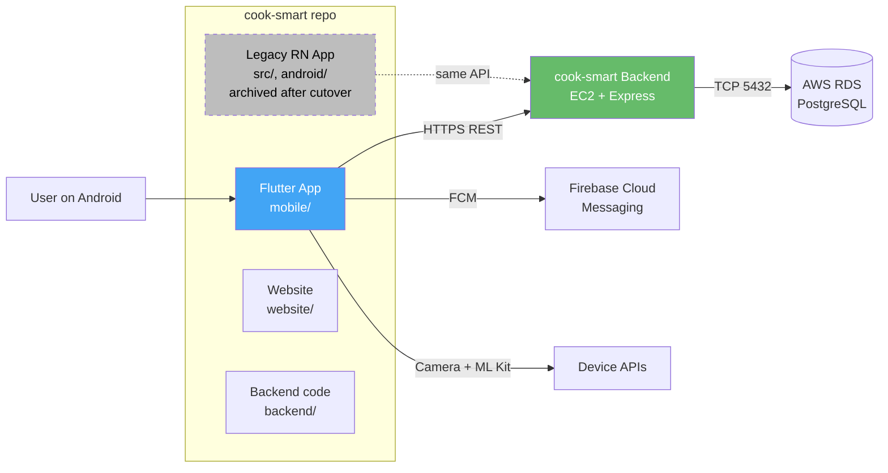
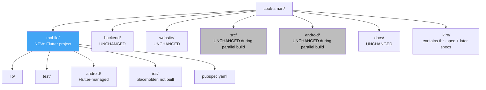
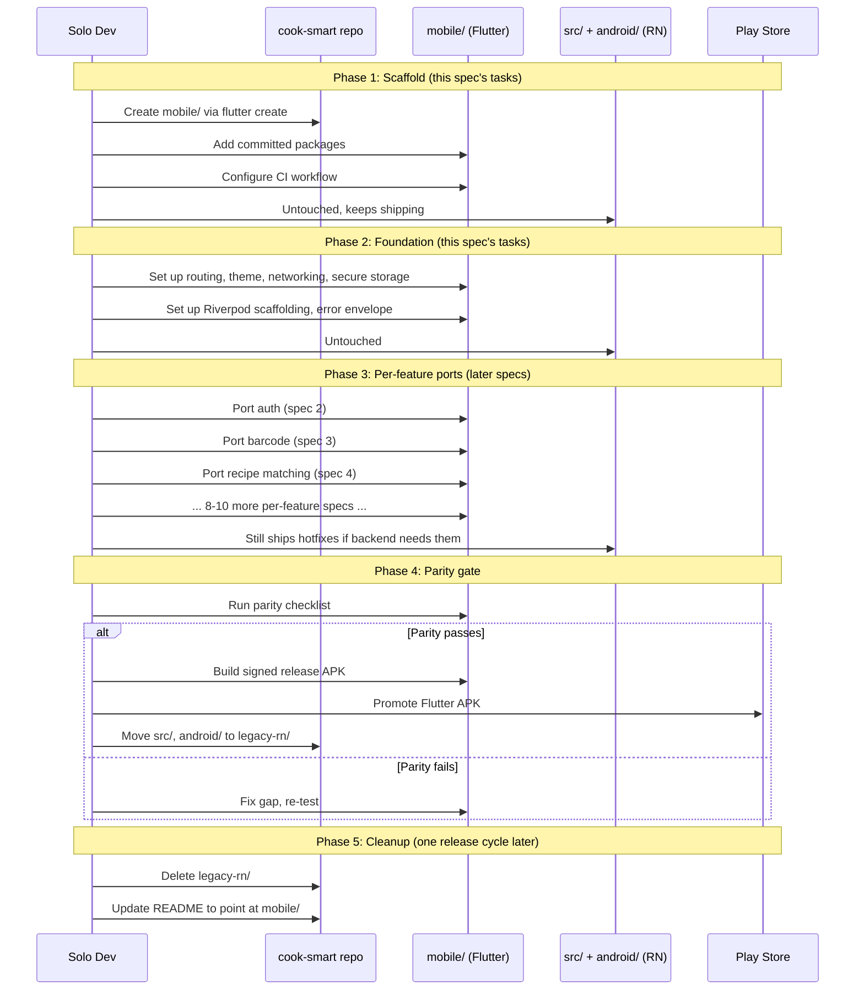
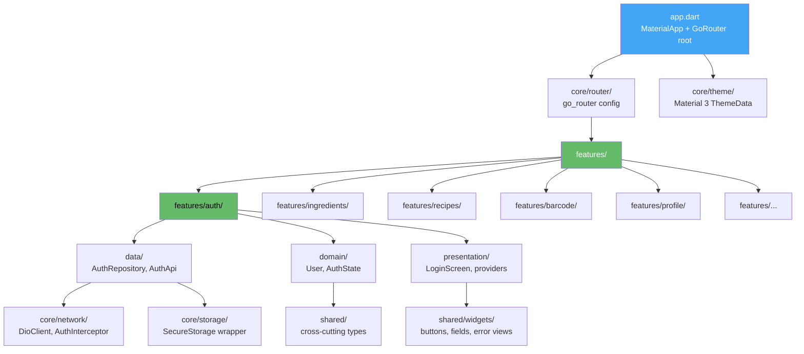

# Design Document: Flutter Migration Architecture

## Overview

This spec defines the architectural foundation for porting the cook-smart mobile app from React Native to Flutter. The framework choice itself is settled in [docs/mobile-framework-evaluation.md](../../../docs/mobile-framework-evaluation.md) and is not relitigated here. What is in scope: where the Flutter code lives, how it is structured, which libraries are committed for state, networking, routing and native features, how the migration is sequenced against the still-shipping React Native app, and how iOS is parked without precluding it.

This is the first of several Flutter migration specs. It owns the foundational decisions every later spec inherits. Per-feature ports (auth, barcode, recipe matching, etc.) are explicitly out of scope and will land as separate specs that follow the order defined at the end of this document.

The audience is a single developer on Windows with verified Flutter 3.44.0 / Dart 3.9.2 toolchain, no live Mac access, and a backend (Node/Express on AWS EC2 + RDS PostgreSQL) that does not change.

## Key Architectural Decisions

The seven decisions below are the load-bearing ones. They are surfaced here, not buried in tasks, because every later spec depends on them.

### Decision 1: Code location — new `mobile/` folder at the repo root

**Choice**: Create `mobile/` at the repo root. The Flutter project lives alongside, not inside, the existing `src/` React Native code.

**Rejected alternatives**:

- **Replace `src/` outright** — forces commitment, but breaks the working RN APK during the 10–14 week port. The cook-smart fork has spent the last week stabilising small PRs against `main`'s pre-existing build break; replacing `src/` would re-break those PRs and leave no shippable Android build during the port window.
- **Sibling `cook-smart-mobile` repo** — cleanest separation, but doubles CI configuration, makes shared documentation harder, and forces a two-repo cross-link for every issue on the project board. For a solo dev, repo sprawl is a real cost.
- **`flutter/` instead of `mobile/`** — `mobile/` is framework-agnostic. If Flutter is ever swapped, the folder name does not need to change. It also reads as "this is the mobile app" to anyone landing in the repo, which is more useful than encoding the framework choice in the path.

**Rationale**: `mobile/` keeps the Flutter port reversible until the cutover moment (Phase 5). The RN code keeps shipping APKs from `src/` + `android/` while Flutter is built in parallel. Every other surface in the repo (`backend/`, `website/`, `docs/`, `.github/workflows/`) is untouched. The cost is a slightly larger repo and one extra path segment; the benefit is that nothing in this spec can break the still-working website or backend.

### Decision 2: Project structure — feature-based folders under `lib/features/`

**Choice**: Feature-based folder layout with a thin `core/` and `shared/` for cross-cutting code. Layer-based subdivision (data/domain/presentation) inside each feature, not at the top level.

**Rejected alternatives**:

- **Top-level layer-based** (`lib/data/`, `lib/domain/`, `lib/ui/`) — scales poorly past ~10 features. Every feature is smeared across three folders, making it hard to find related code or delete a feature cleanly.
- **Flat `lib/screens/` mirroring the current RN layout** — works for small apps, but cook-smart already has 40+ screens and growing. Flat layout makes navigation between related files (a screen, its provider, its repository, its model) painful.

**Rationale**: cook-smart has 12–15 logical features (auth, ingredients, recipes, barcode, favourites, achievements, subscription, etc.). Feature folders make each one a delete-able, move-able unit, which matters because the migration will port features one at a time. Layer subdivision *inside* the feature still gives test isolation (mock the repository in a provider test) without forcing a directory traversal for every related change.

### Decision 3: State management — Riverpod 2.x

**Choice**: [Riverpod](https://riverpod.dev/) 2.x with code generation (`riverpod_generator`).

**Rejected alternatives**:

- **BLoC** — viable for solo dev, but more boilerplate per feature (Event class, State class, Bloc class, mapEventToState). For 12–15 features that is meaningful keystroke and cognitive overhead. BLoC's compile-time guarantees come from sealed states, which Riverpod can also model via sealed classes when needed.
- **Provider** — predecessor to Riverpod, still maintained, but Riverpod is the path the maintainer (Remi Rousselet) is pushing forward. Picking the older option creates upgrade work later for no current benefit.
- **GetX** — popular but mixes state, routing and DI in one container; the community consensus is that this hurts testability and long-term maintenance.
- **Bloc + Cubit hybrid** — would let simple state use Cubits and reserve full BLoC for complex flows. Reasonable, but Riverpod's `Notifier` / `AsyncNotifier` already gives that gradient (a `Provider` for static, a `Notifier` for mutable, an `AsyncNotifier` for async-mutable) without splitting concepts.

**Rationale**: The framework evaluation already leaned Riverpod-ward. Concrete reasons it wins for solo-dev cook-smart:

- Compile-time provider safety via `riverpod_generator` removes a class of "I forgot to register this provider" bugs.
- `ref.watch` / `ref.read` / `ref.listen` is one mental model that covers reading state, reading state once, and side effects. BLoC needs `BlocBuilder` / `BlocListener` / `context.read` for the same coverage.
- Async state via `AsyncValue<T>` (a sealed `loading` / `data` / `error` type) maps directly to the `loading-with-skeleton`, `data`, `error-with-retry` UI states cook-smart already uses.
- Test ergonomics: `ProviderContainer` in a unit test, `ProviderScope.overrides` in a widget test. No mocking framework required for most cases.

**Version pin**: `flutter_riverpod: ^2.5.1`, `riverpod_annotation: ^2.3.5`. (`riverpod_generator ^2.4.0` was removed by the `flutter-port-auth` amendment for the same analyzer-cap conflict that removed `retrofit_generator`. Provider declarations use the hand-written `Provider`/`Notifier`/`AsyncNotifier` constructors permitted by Requirement 3.8.)

### Decision 4: Networking — `dio` + manual JSON

**Choice**: [`dio`](https://pub.dev/packages/dio) for the HTTP client, hand-written `fromJson` / `toJson` on model classes (no `json_serializable` for now). Per-endpoint typed surfaces are defined as feature-shaped seams under `lib/core/network/` (see the `flutter-port-auth` design's Decision 4 for the pattern).

**Rejected alternatives**:

- **`http` package only** — Flutter's stdlib HTTP client. No interceptors, no built-in auth header injection, no per-request retry. Acceptable for a 3-endpoint app, painful for cook-smart's 30+ endpoints.
- **`chopper`** — similar to retrofit but smaller community. Retrofit-Dart has more examples, more StackOverflow coverage, and is what most Riverpod tutorials use.
- **`json_serializable` for codegen** — useful, but adds a build_runner step to every model change. For a solo dev shipping fast, manual `fromJson` is faster to write the first time and easier to debug. Revisit if the model count crosses ~50.

**Rationale**: cook-smart's backend is a stable REST API at `https://api.cooksmartapp.com`. The networking layer needs:

- A single auth-header interceptor (JWT from secure storage).
- A single error normaliser (parse `{ "success": false, "message": "..." }` into a Dart exception).
- Per-request timeout and one retry on 5xx.
- A way to swap the base URL between debug (`http://192.168.12.196:3000`) and release (`https://api.cooksmartapp.com`).

Dio handles all four. Per-endpoint typed surfaces (e.g. `Future<Recipe> getRecipe(int id)`) are built as feature-shaped abstract interfaces in `lib/core/network/` (each feature owns its surface), with the architecture-enforcement script keeping `package:dio` confined to that directory. The original Decision 4 paired `dio` with `retrofit` for the typed methods; `retrofit` was removed in the `flutter-port-auth` amendment because its `analyzer <7.0.0` cap cannot co-exist with `glados`'s `analyzer >= 8.0.0` requirement under Flutter 3.44+. No source under `lib/` imported `retrofit` at removal, so the deletion was free; the feature-seam pattern from `flutter-port-auth/design.md` Decision 4 is the replacement for retrofit's typed-method ergonomics.

**Version pins**: `dio: ^5.4.3`. (`retrofit ^4.1.0` and `retrofit_generator ^8.1.0` were removed by the `flutter-port-auth` amendment — see the paragraph above.)

### Decision 5: Routing — `go_router`

**Choice**: [`go_router`](https://pub.dev/packages/go_router) 14.x.

**Rejected alternatives**:

- **Built-in `Navigator 2.0`** — too low-level. Solo devs spend weeks rebuilding what go_router provides.
- **`auto_route`** — typed routes are nice, but adds another build_runner step and a steeper learning curve. go_router's path-based routing matches React Navigation's mental model, which shortens the port.
- **`beamer`** — declarative routing with similar features, smaller community. go_router is now [the team-recommended option](https://docs.flutter.dev/ui/navigation) on flutter.dev, which matters for a 5-year bet.

**Rationale**: cook-smart's RN app uses React Navigation (Stack + BottomTabs). go_router is the closest 1:1 mental mapping: `GoRoute` ≈ stack route, `StatefulShellRoute` ≈ bottom-tabbed shell. Deep links work out of the box, which the existing RN app does not currently support and which is a desirable byproduct of the port.

**Version pin**: `go_router: ^14.2.0`.

### Decision 6: Migration strategy — hard cutover after parallel build

**Choice**: Parallel-build, hard-cutover release. The Flutter app is built to feature parity in `mobile/` while the RN app keeps shipping from `src/`. When Flutter passes the parity gate, the next Play Store release is Flutter, and the RN code is moved (not deleted) to `legacy-rn/` for one release cycle as a rollback safety net, then deleted.

**Rejected alternatives**:

- **Pure parallel-running (both apps coexist long-term)** — would require either two separate Play Store listings (confusing for users) or a runtime selector in one app (impossible without keeping both bundles, which doubles APK size). Not viable.
- **Hard cutover on day one** — delete RN, build Flutter from scratch in `src/`. Removes the safety net during the 10–14 week port. If the Flutter build hits a blocking issue at week 8, there is no shipping APK for emergencies. Solo dev with no live users today, but cook-smart has a $20/month emergency budget and a backend that is in production — losing the ability to ship a hotfix to the RN app for 14 weeks is a real risk.
- **Gradual feature-by-feature replacement (RN host with embedded Flutter modules)** — Flutter supports add-to-app, but it is complex, requires both Gradle and Flutter to build cleanly together, and the "hybrid composition" boundary is exactly the kind of build-system fragility the framework eval doc says we are trying to escape. Not appropriate.

**Rationale**: cook-smart has no live users (per the user). The "no live users" fact is what makes hard cutover safe, but the parallel-build phase still matters because it preserves the ability to ship an RN hotfix during the port if the backend or website needs an aligned mobile change. The legacy archive (one release cycle) lets the developer roll back if a critical Flutter regression ships.

**Cutover gate** (binary, not a vibe-check): all parity checklist items pass, smoke test on physical Android device passes, release APK builds with proper signing.

### Decision 7: iOS deferral — placeholder Xcode project, not built in CI

**Choice**: Run `flutter create` with both platforms (`--platforms=android,ios`) at scaffold time. The `ios/` folder is committed to the repo. CI builds Android only; iOS is documented as "not built, not signed, not shipped" until Mac access is justified.

**Rejected alternatives**:

- **Android-only scaffold (`--platforms=android`)** — leaves no `ios/` folder. Adding iOS later means re-running `flutter create .` over the existing project, which works but is fiddly and risks overwriting customisations. Worse, it tempts solo devs into Android-only plugin choices that need un-doing later.
- **Remove `ios/` after scaffold** — same problem, more deliberate.

**Rationale**: An empty `ios/` folder costs ~50 KB on disk and zero CI minutes (because CI does not run `flutter build ios`). It signals to every later spec, every plugin choice, and every state-management decision that iOS is in scope, just parked. This forces the architecture to stay iOS-compatible without paying for iOS work yet. The plugin list in this spec specifically rejects Android-only packages even when an Android-only alternative is simpler.

When iOS is greenlit later, the work is: Mac access → `cd mobile && flutter build ios` → fix what broke → ship. No structural rework.

## Decisions Surfaced in the Body, Not Numbered

These also need a clear answer but are smaller.

### Theme and design system — Material 3, refresh allowed

The current RN app uses ad-hoc styling per screen. There is no shared theme file. The Flutter port adopts **Material 3** as the base theme system, with Cupertino widget overrides on iOS-specific surfaces (date pickers, action sheets) when iOS ships.

The Flutter port is **not pixel-for-pixel** with the current RN app. It is an opportunity to consolidate visual style into a single `ThemeData`, drop the visual debt from 40+ screens of inconsistent styling, and produce a clean design baseline. Match the *brand* (logo, primary colour, typography hierarchy) but not screen-by-screen layout. Per-feature specs that follow may revisit individual screens.

### Backend contract — no changes

The Flutter port consumes the existing REST API at `https://api.cooksmartapp.com`. **No backend changes are implied by this spec.** Specifically:

- No new endpoints.
- No changes to request/response shapes.
- No changes to auth flow (JWT in `Authorization: Bearer` header, same as RN).
- No changes to error envelope (`{ success, message, data }`).

If a per-feature spec discovers a missing endpoint during the port, that is a separate decision filed as a separate issue against the backend, not absorbed into the migration.

## Architecture

### System Context



The Flutter app is one of three deliverables in the cook-smart monorepo (alongside `website/` and `backend/`). The legacy RN app is shown dashed because it survives the parallel-build phase but is archived after the hard cutover.

### Repo Layout After This Spec Lands



`mobile/android/` is the Flutter-managed Android project (different from the repo-root `android/` which belongs to the RN app). After cutover, `src/` and the repo-root `android/` move to `legacy-rn/` for one release cycle and are then deleted.

### Migration Phases (Sequence Diagram)



### Component Map (Inside `mobile/lib/`)



Every feature folder follows the same `data/` + `domain/` + `presentation/` shape internally. `core/` holds singletons and infrastructure. `shared/` holds cross-feature widgets and types.

## Low-Level Design

### Folder Structure (Exact Layout)

```text
mobile/
├── android/                         # Flutter-managed Android project
├── ios/                             # placeholder, not built in CI
├── lib/
│   ├── main.dart                    # entry point — runs runApp(ProviderScope(child: CookSmartApp()))
│   ├── app.dart                     # CookSmartApp widget — MaterialApp.router + theme + router
│   ├── core/
│   │   ├── config/
│   │   │   ├── api_config.dart      # base URL switch (debug vs release)
│   │   │   └── app_config.dart      # build-time constants
│   │   ├── network/
│   │   │   ├── dio_client.dart      # singleton Dio with interceptors
│   │   │   ├── auth_interceptor.dart
│   │   │   ├── error_interceptor.dart
│   │   │   └── api_exception.dart   # typed exception hierarchy
│   │   ├── router/
│   │   │   ├── app_router.dart      # GoRouter config
│   │   │   └── routes.dart          # route name constants
│   │   ├── storage/
│   │   │   └── secure_storage.dart  # flutter_secure_storage wrapper
│   │   └── theme/
│   │       ├── app_theme.dart       # ThemeData light + dark
│   │       └── app_colours.dart     # brand colour tokens
│   ├── features/
│   │   ├── auth/
│   │   │   ├── data/
│   │   │   │   ├── auth_api.dart
│   │   │   │   └── auth_repository.dart
│   │   │   ├── domain/
│   │   │   │   ├── user.dart
│   │   │   │   └── auth_state.dart
│   │   │   └── presentation/
│   │   │       ├── login_screen.dart
│   │   │       ├── signup_screen.dart
│   │   │       └── auth_provider.dart
│   │   ├── ingredients/
│   │   ├── recipes/
│   │   ├── barcode/
│   │   ├── favourites/
│   │   ├── achievements/
│   │   ├── profile/
│   │   ├── subscription/
│   │   ├── shopping_list/
│   │   ├── meal_planning/
│   │   ├── notifications/
│   │   └── settings/
│   └── shared/
│       ├── widgets/
│       │   ├── primary_button.dart
│       │   ├── error_view.dart
│       │   └── loading_skeleton.dart
│       └── extensions/
│           └── async_value_x.dart
├── test/
│   ├── core/
│   ├── features/
│   └── shared/
├── integration_test/                # harness only, no tests yet
├── pubspec.yaml
├── analysis_options.yaml            # very_good_analysis ruleset
└── README.md                        # how to run, build, test
```

### File Naming Conventions

- **Files**: `snake_case.dart`. Always. (`login_screen.dart`, not `LoginScreen.dart`.)
- **Classes**: `PascalCase` (`LoginScreen`, `AuthRepository`).
- **Enums and types**: `PascalCase` (`AuthState`, `RecipeMatchScore`).
- **Constants**: `camelCase` for module-level, `kPascalCase` reserved for compile-time constants used as widget defaults.
- **Riverpod providers**: `camelCase` ending in `Provider` (`authProvider`, `recipeListProvider`).
- **Test files**: mirror source path with `_test.dart` suffix (`features/auth/data/auth_repository.dart` → `test/features/auth/data/auth_repository_test.dart`).

### Committed Package List

Every package below is committed by this spec. Per-feature specs may add more, but they may not change these without amending this spec.

```yaml
# pubspec.yaml — relevant excerpt
environment:
  sdk: ">=3.9.0 <4.0.0"
  flutter: ">=3.44.0"

dependencies:
  flutter:
    sdk: flutter

  # State management
  flutter_riverpod: ^2.5.1
  riverpod_annotation: ^2.3.5

  # Routing
  go_router: ^14.2.0

  # Networking
  dio: ^5.4.3
  # NOTE: retrofit ^4.1.0 was removed by the flutter-port-auth spec — see
  # Decision 4 above for the full rationale.

  # Storage
  flutter_secure_storage: ^9.2.2     # JWT, refresh token
  shared_preferences: ^2.2.3         # non-sensitive prefs (theme mode, last screen)

  # Native features — committed list
  mobile_scanner: ^5.1.1             # camera + barcode (replaces react-native-camera-kit)
  firebase_core: ^3.1.0
  firebase_messaging: ^15.0.0        # FCM push (replaces @react-native-firebase/messaging)
  just_audio: ^0.9.38                # audio playback (replaces react-native-sound)
  audio_service: ^0.18.13            # background audio support — opt-in per per-feature spec
  flutter_native_splash: ^2.4.0      # splash screen
  package_info_plus: ^8.0.0          # app version display
  url_launcher: ^6.3.0               # external links (privacy policy, ToS)

  # UI
  cached_network_image: ^3.3.1       # recipe image caching
  shimmer: ^3.0.0                    # loading skeletons

dev_dependencies:
  flutter_test:
    sdk: flutter
  integration_test:
    sdk: flutter

  # Lints
  very_good_analysis: ^6.0.0

  # Codegen
  build_runner: ^2.4.11
  # NOTE: riverpod_generator ^2.4.0 and retrofit_generator ^8.1.0 were
  # removed by the flutter-port-auth spec — see Decision 3 (Riverpod) and
  # Decision 4 (Networking) above for the full rationale.

  # Property-based testing (added by flutter-port-auth Task 1.1)
  glados: ^1.1.6

  # Test helpers
  mocktail: ^1.0.4
```

**Package decisions worth calling out**:

- **`mobile_scanner` over `flutter_barcode_scanner`** — the eval doc recommends mobile_scanner; it covers both ML Kit (Android) and Apple Vision (iOS) behind a uniform API and is actively maintained through 2026. flutter_barcode_scanner is unmaintained.
- **`firebase_messaging` (FlutterFire), not a community wrapper** — official, Google-maintained, direct upstream support.
- **`flutter_secure_storage` for JWT, `shared_preferences` for theme mode** — splitting sensitive vs non-sensitive storage avoids needing Keystore/Keychain reads on every app launch for trivial prefs.
- **`just_audio` over `audioplayers`** — better maintenance, supports background playback via `audio_service`. The current RN app uses `react-native-sound` for short clips; `just_audio` covers both short and long playback.
- **No `material_design_icons_flutter`** — Flutter's built-in `Icons.*` is sufficient for cook-smart's needs. Custom icons go in `assets/icons/` as SVGs via `flutter_svg` if a per-feature spec needs them.
- **`very_good_analysis` over `flutter_lints`** — stricter ruleset, fewer surprises. Solo dev benefits from the linter being noisy.

**No iOS-only or Android-only packages where alternatives exist.** Every package above supports both platforms. This is enforced by the iOS-deferral decision: anything that would need replacing for iOS is rejected here.

### Core Type Contracts

These types are committed by this spec because every feature uses them.

```dart
// lib/core/network/api_exception.dart
sealed class ApiException implements Exception {
  const ApiException(this.message);
  final String message;
}

final class NetworkException extends ApiException {
  const NetworkException(super.message);
}

final class UnauthorisedException extends ApiException {
  const UnauthorisedException(super.message);
}

final class ServerException extends ApiException {
  const ServerException(super.message, this.statusCode);
  final int statusCode;
}

final class ValidationException extends ApiException {
  const ValidationException(super.message, this.fieldErrors);
  final Map<String, String> fieldErrors;
}
```

```dart
// lib/core/network/api_response.dart
// Mirrors backend envelope: { success, message, data }
class ApiResponse<DataType> {
  ApiResponse({
    required this.success,
    required this.message,
    this.data,
  });

  factory ApiResponse.fromJson(
    Map<String, dynamic> json,
    DataType Function(dynamic) dataParser,
  ) {
    return ApiResponse<DataType>(
      success: json['success'] as bool,
      message: json['message'] as String? ?? '',
      data: json['data'] != null ? dataParser(json['data']) : null,
    );
  }

  final bool success;
  final String message;
  final DataType? data;
}
```

```dart
// lib/core/storage/secure_storage.dart
// Thin wrapper so feature code never imports flutter_secure_storage directly.
// Lets the storage backend swap without a sweep through every feature.
abstract class SecureStorage {
  Future<void> writeToken(String key, String value);
  Future<String?> readToken(String key);
  Future<void> deleteToken(String key);
  Future<void> clearAll();
}
```

### Networking — Dio Client Setup

```dart
// lib/core/network/dio_client.dart
import 'package:dio/dio.dart';
import 'package:flutter_riverpod/flutter_riverpod.dart';

import 'auth_interceptor.dart';
import 'error_interceptor.dart';
import '../config/api_config.dart';
import '../storage/secure_storage.dart';

final dioProvider = Provider<Dio>((ref) {
  final dio = Dio(BaseOptions(
    baseUrl: ApiConfig.baseUrl,
    connectTimeout: const Duration(seconds: 10),
    receiveTimeout: const Duration(seconds: 15),
    contentType: 'application/json',
    validateStatus: (status) => status != null && status < 500,
  ));

  dio.interceptors.addAll([
    AuthInterceptor(ref.read(secureStorageProvider)),
    ErrorInterceptor(),
  ]);

  return dio;
});
```

```dart
// lib/core/config/api_config.dart
class ApiConfig {
  ApiConfig._();

  static const String _devBaseUrl = 'http://192.168.12.196:3000';
  static const String _prodBaseUrl = 'https://api.cooksmartapp.com';

  // kReleaseMode is a const bool from foundation.dart.
  // Same intent as the existing RN api-configuration steering rule:
  // release builds always use production.
  static String get baseUrl =>
      const bool.fromEnvironment('dart.vm.product') ? _prodBaseUrl : _devBaseUrl;
}
```

### Routing — go_router Skeleton

```dart
// lib/core/router/app_router.dart
import 'package:flutter_riverpod/flutter_riverpod.dart';
import 'package:go_router/go_router.dart';

final routerProvider = Provider<GoRouter>((ref) {
  final authState = ref.watch(authProvider);

  return GoRouter(
    initialLocation: '/',
    redirect: (context, state) {
      final isLoggedIn = authState.isAuthenticated;
      final isAuthRoute = state.matchedLocation.startsWith('/auth');
      if (!isLoggedIn && !isAuthRoute) return '/auth/login';
      if (isLoggedIn && isAuthRoute) return '/';
      return null;
    },
    routes: [
      // Auth — outside the shell, no bottom tabs.
      GoRoute(path: '/auth/login', builder: (_, __) => const LoginScreen()),
      GoRoute(path: '/auth/signup', builder: (_, __) => const SignupScreen()),

      // Main shell with bottom tabs.
      StatefulShellRoute.indexedStack(
        builder: (_, __, shell) => MainShell(shell: shell),
        branches: [
          StatefulShellBranch(routes: [
            GoRoute(path: '/', builder: (_, __) => const HomeScreen()),
          ]),
          StatefulShellBranch(routes: [
            GoRoute(path: '/recipes', builder: (_, __) => const RecipeSearchScreen()),
          ]),
          StatefulShellBranch(routes: [
            GoRoute(path: '/favourites', builder: (_, __) => const FavouritesScreen()),
          ]),
          StatefulShellBranch(routes: [
            GoRoute(path: '/profile', builder: (_, __) => const ProfileScreen()),
          ]),
        ],
      ),
    ],
  );
});
```

### State Management — Riverpod Pattern

The committed pattern for any async-loaded feature data:

```dart
// lib/features/recipes/presentation/recipe_list_provider.dart
import 'package:riverpod_annotation/riverpod_annotation.dart';

part 'recipe_list_provider.g.dart';

@riverpod
Future<List<Recipe>> recipeList(RecipeListRef ref, String query) async {
  final repository = ref.read(recipeRepositoryProvider);
  return repository.search(query);
}
```

```dart
// Consumed in a widget.
class RecipeListView extends ConsumerWidget {
  const RecipeListView({required this.query, super.key});
  final String query;

  @override
  Widget build(BuildContext context, WidgetRef ref) {
    final asyncRecipes = ref.watch(recipeListProvider(query));

    return asyncRecipes.when(
      loading: () => const LoadingSkeleton(),
      error: (error, _) => ErrorView(
        message: error is ApiException ? error.message : 'Something went wrong',
        onRetry: () => ref.invalidate(recipeListProvider(query)),
      ),
      data: (recipes) => ListView.builder(
        itemCount: recipes.length,
        itemBuilder: (_, i) => RecipeCard(recipe: recipes[i]),
      ),
    );
  }
}
```

The triad of `loading` / `error` / `data` is standard. Per-feature specs do not invent variations.

### Algorithmic Pseudocode — The Cutover Decision Loop

The hard cutover is the single highest-risk moment. Pseudocode for the gate:

```pascal
ALGORITHM cutoverGate(parityChecklist, smokeTestResult, signedApk)
INPUT:
  parityChecklist: List of {feature, status: pass | fail | skip}
  smokeTestResult: pass | fail
  signedApk: present | absent
OUTPUT:
  decision: cutover | block

BEGIN
  // Precondition: every feature on the parity checklist has been ported.
  ASSERT parityChecklist.length >= 12

  failedFeatures ← parityChecklist.filter(f => f.status = fail)

  IF failedFeatures.length > 0 THEN
    LOG "blocked: features failing parity: " + failedFeatures
    RETURN block
  END IF

  IF smokeTestResult ≠ pass THEN
    LOG "blocked: smoke test failed on physical Android device"
    RETURN block
  END IF

  IF signedApk = absent THEN
    LOG "blocked: release APK not signed with production keystore"
    RETURN block
  END IF

  // All gates passed.
  LOG "cutover gate passed; promote Flutter APK to Play Store"
  RETURN cutover
END
```

**Preconditions**:

- All in-scope features (per the per-feature specs) have been ported.
- `parityChecklist` is the explicit list maintained in this spec's tasks file.

**Postconditions**:

- `cutover` ⇒ Flutter APK is the next Play Store release; `src/` and `android/` are moved to `legacy-rn/`.
- `block` ⇒ no cutover. The blocking item is filed as an issue and fixed before re-running the gate.

**Loop invariant** (across the multi-day port window): at no point during the parallel-build phase does the RN app fail to build a release APK. If a commit breaks the RN build, it is reverted before any Flutter work continues.

### Algorithmic Pseudocode — RN Archive and Delete

```pascal
ALGORITHM archiveLegacyRn()
INPUT: none (assumes cutoverGate returned cutover)
OUTPUT: legacy-rn/ folder created, release tag pushed

BEGIN
  ASSERT cutoverGate(...) = cutover

  // Step 1: move, don't delete. Preserves rollback capability.
  git mv src/ legacy-rn/src/
  git mv android/ legacy-rn/android/
  git mv App.tsx legacy-rn/App.tsx
  git mv package.json legacy-rn/package.json
  git mv babel.config.js legacy-rn/babel.config.js
  git mv app.json legacy-rn/app.json

  // Step 2: stop CI from running RN checks.
  edit .github/workflows/ci.yml — remove RN job, keep backend + website + flutter

  // Step 3: tag the moment.
  git tag rn-final-snapshot
  git push origin rn-final-snapshot

  // Step 4: write a one-page README in legacy-rn/ explaining how to revive
  // the RN app if the Flutter version is rolled back.
  create legacy-rn/README.md

  // Postcondition: one Play Store release later, if no rollback was needed:
  AFTER one release cycle (≥ 14 days, ≥ 1 stable release post-cutover):
    git rm -r legacy-rn/
END
```

**Preconditions**:

- Cutover gate has passed.
- Backups (the `rn-final-snapshot` tag) are pushed.

**Postconditions**:

- `src/`, root `android/`, and root RN config files are gone from the working tree.
- `legacy-rn/` exists for one release cycle, then is deleted.
- The `rn-final-snapshot` git tag remains permanently as a recoverable point.

## Components and Interfaces

### Component: `mobile/lib/core/network/`

**Purpose**: Provide a single configured Dio instance and the typed exception hierarchy that wraps it.

**Interface**:

```dart
abstract class ApiClient {
  Future<T> get<T>(String path, {Map<String, dynamic>? queryParameters});
  Future<T> post<T>(String path, {Object? data});
  Future<T> put<T>(String path, {Object? data});
  Future<T> delete<T>(String path);
}
```

**Responsibilities**:

- Inject JWT into every authenticated request.
- Translate Dio errors into the `ApiException` hierarchy.
- Honour the dev-vs-release base URL switch (matches the existing `api-configuration.md` steering rule).

### Component: `mobile/lib/core/router/`

**Purpose**: Single source of truth for routes, including auth-gated redirects.

**Interface**: a `Provider<GoRouter>` consumed by `MaterialApp.router`.

**Responsibilities**:

- Define every route name as a constant (no string literals at call sites).
- Redirect unauthenticated users to `/auth/login`.
- Deep-link handling (out of scope for this spec to wire up but the router supports it).

### Component: `mobile/lib/core/storage/`

**Purpose**: Hide the choice of `flutter_secure_storage` from every feature, so swapping later (or adding a Hive-backed cache) is a one-file change.

**Interface**: `abstract class SecureStorage` (signature shown above).

**Responsibilities**: read, write, delete, clear secure values. No business logic.

### Component: `mobile/lib/core/theme/`

**Purpose**: One `ThemeData` light + dark, plus brand colour tokens.

**Interface**:

```dart
class AppTheme {
  static ThemeData light();
  static ThemeData dark();
}

class AppColours {
  static const Color brandPrimary = Color(0xFF...);
  // etc.
}
```

**Responsibilities**: Material 3 theming. Per-feature specs do not redefine colours.

## Data Models

### Model: `User`

```dart
class User {
  User({
    required this.id,
    required this.email,
    required this.displayName,
    required this.createdAt,
  });

  factory User.fromJson(Map<String, dynamic> json) => User(
        id: json['id'] as int,
        email: json['email'] as String,
        displayName: json['displayName'] as String,
        createdAt: DateTime.parse(json['createdAt'] as String),
      );

  final int id;
  final String email;
  final String displayName;
  final DateTime createdAt;
}
```

**Validation rules**:

- `email` non-empty, contains `@`.
- `displayName` non-empty.
- `id` positive.

The full per-feature data models are out of scope for this spec — the auth port spec defines the auth ones, the recipes port spec defines the recipe ones, etc.

## Correctness Properties

These properties hold across every feature in `mobile/`. Per-feature specs may add more.

### Property 1: Secure storage encapsulation

No feature imports `flutter_secure_storage` directly. All access goes through `lib/core/storage/secure_storage.dart`. This makes the storage backend swappable without sweeping every feature.

### Property 2: Network client encapsulation

No feature imports `dio` directly except `lib/core/network/`. Feature data layers use the typed `ApiClient` interface or a feature-shaped seam declared under `lib/core/network/` (per the `flutter-port-auth` design's Decision 4 pattern). This keeps interceptors (auth, error normalisation) authoritative for every request.

### Property 3: Singleton infrastructure via providers

No widget creates its own `Dio` or `GoRouter` instance. Singletons live in providers; widgets read them via `ref`. Prevents duplicate clients with diverging interceptor stacks.

### Property 4: Consistent async UI

Every async UI surface uses `AsyncValue<T>.when(loading, error, data)`. No raw `FutureBuilder` in feature code. This keeps loading and error UX consistent across the whole app.

### Property 5: Release builds use production base URL

Compile-time check via `bool.fromEnvironment('dart.vm.product')`. Mirrors the existing RN `api-configuration.md` steering rule. Release builds must never hit `192.168.12.196:3000`.

### Property 6: No Android-only packages where alternatives exist

Every committed package in `pubspec.yaml` supports both Android and iOS, even though iOS is parked. Preserves the no-rework iOS deferral.

### Property 7: RN parallel-build invariant

During the parallel-build phase, the RN app builds a release APK on every commit. Enforced by CI. If a commit breaks the RN build, it is reverted before any Flutter work continues.

## Testing Strategy

### Unit Testing Approach

Unit tests cover repositories, services, and pure functions. Mocks via `mocktail` (no `build_runner` step required). Provider container construction is the one-liner `ProviderContainer(overrides: [...])`. Coverage goal for foundation-phase code: 80%; per-feature specs may set their own.

### Widget Testing Approach

One widget test per non-trivial widget. Provider overrides via `ProviderScope.overrides` to inject fake data. `tester.pump()` and `tester.pumpAndSettle()` exercise async flows. Golden tests are **not** adopted in this phase; they will be re-baselined when iOS lands.

### Property-Based Testing Approach

Deferred to per-feature specs. The architecture spec sets up the harness only; no property tests are written here.

**Property Test Library**: when adopted, [`fast_check_dart`](https://pub.dev/packages/fast_check_dart) (the Dart port of fast-check). Each per-feature spec decides whether property tests apply.

### Integration Testing Approach

Harness set up via the `integration_test` package, but no integration tests written in this phase. Per-feature specs add integration tests for stable flows (login, recipe search, barcode → product lookup) once the underlying screens stop changing.

### CI Coverage

`.github/workflows/` runs unit + widget tests on every PR touching `mobile/`. The RN tests under `__tests__/` keep running on every PR until cutover (Property 7).

## Error Handling

### Scenario: Backend returns `{ success: false, message: "..." }`

**Condition**: Any non-network error from the API.
**Response**: `ErrorInterceptor` converts to a typed `ApiException` subclass; UI renders via `AsyncValue.error` → `ErrorView`.
**Recovery**: User-visible retry button on the `ErrorView`. Most provider invalidations are idempotent.

### Scenario: 401 Unauthorised mid-session

**Condition**: JWT expired.
**Response**: `AuthInterceptor` catches 401, attempts a single refresh-token call, retries the original request. If refresh fails, clears tokens and the router redirects to `/auth/login`.
**Recovery**: Re-authentication.

### Scenario: Network unreachable

**Condition**: `DioException.type == connectionError` or `connectionTimeout`.
**Response**: `NetworkException` thrown; UI shows offline empty-state widget.
**Recovery**: User retries. No automatic background retry in v1.

### Scenario: Flutter app crashes on a screen during the parallel-build phase

**Condition**: Pre-cutover. RN app is still the released version.
**Response**: Crash logged via `FlutterError.onError` and `PlatformDispatcher.instance.onError`. Sent to Firebase Crashlytics (set up in the foundation phase).
**Recovery**: Fix in `mobile/`, RN app users are unaffected.

### Scenario: Critical regression discovered post-cutover

**Condition**: Flutter is live on Play Store, severe bug.
**Response**: Two paths:

1. Hotfix in `mobile/` and ship within 24 hours if possible.
2. Roll back: build an APK from the `rn-final-snapshot` tag in `legacy-rn/`, sign with the same keystore, promote to Play Store.

**Recovery**: This is why `legacy-rn/` survives one release cycle. After that window, only path 1 is available.

## Performance Considerations

This spec does not commit to specific performance numbers — those belong in per-feature specs. What it does commit to:

- **App startup**: Material 3 baseline, lazy provider initialisation. Riverpod providers are lazy by default; nothing runs until first `ref.watch`.
- **Image caching**: `cached_network_image` for every recipe image. Default disk cache size is sufficient.
- **Bundle size**: Flutter release APKs are ~15–20 MB larger than equivalent RN due to the Dart runtime. Acceptable. The 41.4 MB smoke-build APK is in line.
- **Build time**: First clean build ~5 minutes (verified). Hot reload <1 second. Full release build ~3–4 minutes on the user's Windows machine.

## Security Considerations

- **JWT in `flutter_secure_storage`**, not `SharedPreferences`. Android Keystore-backed.
- **Cert pinning**: deferred. Add via a Dio interceptor in a later spec if/when threat-modelled.
- **No secrets in code**: API keys (Firebase, etc.) come from `google-services.json` (Android) and a `.env`-equivalent loaded at build time, mirroring the backend `.env` pattern.
- **Backend trust**: same TLS endpoint as RN app today. No changes.

## Dependencies

### External libraries

See the `pubspec.yaml` excerpt above. Every committed package has a maintained upstream as of May 2026.

### External services

- Firebase Cloud Messaging (existing project, same `google-services.json` is reusable in the Flutter Android project).
- cook-smart backend at `https://api.cooksmartapp.com` (unchanged).

### Tooling

- Flutter 3.44.0 (verified).
- Dart 3.9.2 (verified).
- Android SDK at `C:\Android\Sdk` (verified).
- JDK 17 Temurin (verified).
- Mac access for iOS: **deferred**.

## Order of Per-Feature Specs (Sequenced Issue List)

This is the sequence per-feature specs should be opened in. Each one is a separate spec under `.kiro/specs/` and a separate epic on the project board at <https://github.com/users/mikeartee/projects/6>.

The ordering optimises for:

- **Foundations first**: networking, theming and auth unblock everything else.
- **Risk first**: barcode is the riskiest feature (camera, ML Kit, plugin maturity) so it lands early; if it fails, the migration window has time to react.
- **User-visible value first within tiers**: recipe search before favourites before achievements, because each one is more dependent on the previous.

| # | Spec name | What it ports | Blocks |
|---|-----------|---------------|--------|
| 0 | `flutter-migration-architecture` (this spec) | Foundation, no features | All others |
| 1 | `flutter-port-auth` | Login, signup, forgot-password, reset-password, change-password, JWT lifecycle | All authenticated features |
| 2 | `flutter-port-home-shell` | Bottom tabs, home screen, navigation skeleton | UI tiers |
| 3 | `flutter-port-ingredients-input` | Ingredient input screen, ingredient service | Recipe matching |
| 4 | `flutter-port-recipe-search` | Recipe search, recipe results, recipe detail | Favourites, ratings |
| 5 | `flutter-port-barcode-scanner` | Camera permissions, barcode scan, product lookup | (independent — scheduled here for risk surfacing) |
| 6 | `flutter-port-favourites` | Favourites screen, favourite/unfavourite | (depends on recipes) |
| 7 | `flutter-port-trending-seasonal` | Trending recipes, seasonal recipes screens | — |
| 8 | `flutter-port-profile` | Profile screen, account settings, preferences | Subscription, dietary |
| 9 | `flutter-port-achievements` | Achievements screen and modal | — |
| 10 | `flutter-port-subscription-paywall` | Subscription plans, billing history, payment methods | — |
| 11 | `flutter-port-shopping-meal-planning` | Shopping list, meal planning | — |
| 12 | `flutter-port-notifications` | Push notification setup, notification settings | (depends on auth) |
| 13 | `flutter-port-misc-policies` | Privacy policy, ToS, data policy, cookie consent, beta feedback | — |
| 14 | `flutter-cutover-and-archive` | Run cutover gate, move RN to `legacy-rn/`, sign release APK, promote | Post-cutover work |
| 15 | `flutter-ios-enablement` | When Mac access lands: iOS build, signing, App Store submission | — |

Specs 1–13 can partially overlap once auth (1) and the home shell (2) are in. Specs 6, 7, 9, 11 are independent of each other and can be done in any order or parallelised if priorities shift.

## Out of Scope

Stated explicitly so per-feature specs don't accidentally absorb this work:

- Per-feature data models, repositories, screens.
- Backend changes of any kind.
- iOS-specific UI (Cupertino) tuning.
- Golden tests, integration test bodies, property-based test bodies.
- Cert pinning, advanced telemetry, A/B testing infrastructure.
- Removing the website, backend, or anything outside `src/` + root `android/`.
- Changing the project board structure or labels.

## Glossary

- **Cutover gate**: the binary check (defined in `cutoverGate` pseudocode above) that decides whether the next Play Store release is Flutter.
- **Parallel-build phase**: the 10–14 week window where `mobile/` (Flutter) and `src/` + `android/` (RN) both build cleanly.
- **Legacy archive**: `legacy-rn/` folder containing the RN source for one release cycle post-cutover.
- **Per-feature spec**: any of specs 1–15 in the table above.
- **Foundation phase**: this spec's tasks — scaffold + `core/` + `shared/` + first round of providers — before any feature is ported.
