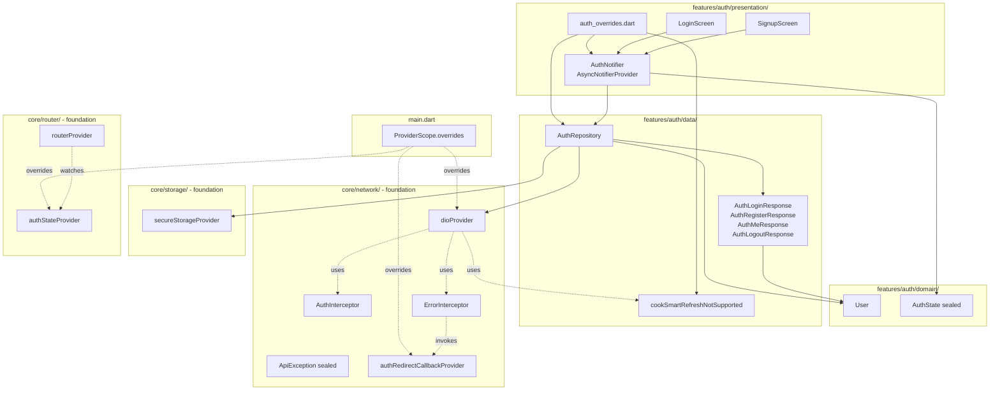

# Design Document

## Overview

This design ports the cook-smart authentication feature from the React Native app under `src/` to the Flutter app under `mobile/`, against the four `/api/v1/auth/*` endpoints the backend already exposes (`POST /register`, `POST /login`, `GET /me`, `POST /logout`). The shape is fixed by the requirements: a Riverpod-driven `AuthNotifier` mounted at `mobile/lib/features/auth/presentation/auth_notifier.dart`, a thin `AuthRepository` at `mobile/lib/features/auth/data/auth_repository.dart`, a sealed `AuthState` and a `User` value type under `mobile/lib/features/auth/domain/`, and `LoginScreen` / `SignupScreen` widgets under `presentation/` whose entire job is to drive the notifier and render its three states.

The feature inherits every infrastructure decision the foundation already shipped. It does not modify any file under `mobile/lib/core/` and adds no package to `pubspec.yaml`; everything it needs (Dio, Riverpod, secure storage, GoRouter, the typed exception hierarchy, the `AuthInterceptor` JWT injection, the `ErrorInterceptor` 401 path) already exists. The single net behavioural change is replacing two foundation defaults — the no-op `authRedirectCallbackProvider` and the throwing `_unimplementedRefreshCall` — with values that close the auth loop. Both replacements happen as `ProviderScope` overrides in `main.dart`. `core/` files are not touched.

Three architectural decisions were deferred from the foundation phase to this spec because they require knowing the auth feature's shape. Each is decided here, with the alternatives weighed and the rationale recorded:

1. **Response envelope parsing strategy** — feature-local parsing (Option A), not foundation amendment.
2. **Refresh-token dead code** — synchronous-throw stub `cookSmartRefreshNotSupported`, not deletion of `RefreshTokenCall`.
3. **`ProviderScope` wiring** — overrides applied in `main.dart`'s root `ProviderScope`, not a second scope or a feature-local bootstrapper.

Section "Architectural Decisions" weighs the alternatives in detail. The following sections describe the design that flows from those choices.

## Architecture

### Layering

The feature follows the foundation's `data/domain/presentation` split, with each layer owning exactly one concern:

- **`domain/`** holds the value types: `User` (the union model from Requirement 4) and `AuthState` (the sealed state machine from Requirement 6). No imports from `data/` or `presentation/`. No imports from `core/network/` or `core/storage/`.
- **`data/`** holds the HTTP and storage layer: `AuthRepository` (the only file that calls the four endpoints and the only file under `features/auth/` that talks to `SecureStorage`), plus four typed response classes (`AuthLoginResponse`, `AuthRegisterResponse`, `AuthMeResponse`, `AuthLogoutResponse`) that decode the actual backend shapes. `data/` consumes `core/network/` (via `dioProvider`) and `core/storage/` (via `secureStorageProvider`); it never imports `presentation/`.
- **`presentation/`** holds the Riverpod notifier, the screens, and the foundation overrides: `AuthNotifier`, `LoginScreen`, `SignupScreen`, plus a small `auth_overrides.dart` module that `main.dart` imports to compose the `ProviderScope` overrides. `presentation/` consumes `domain/` and `data/`. It never imports `package:dio` (lint-enforced) and never constructs `Dio(` or `GoRouter(` (lint-enforced).

### Module Diagram



### Cross-Cutting Flows

Three flows span layers and motivate the architectural decisions below:

**Authenticated request lifecycle.** A repository call goes through `dio.get` / `dio.post`; `AuthInterceptor` reads the JWT under key `'jwt'` and attaches `Authorization: Bearer …` (or rejects when `requiresAuth == true` and no JWT is present); the request hits the backend; the response returns to the repository. On `401`, `ErrorInterceptor` consults the configured `RefreshTokenCall` — which in this feature is `cookSmartRefreshNotSupported` — gets an `UnauthorisedException` synchronously, clears storage via `SecureStorage.clearAll`, and invokes `authRedirectCallbackProvider`'s callback, which navigates to `/auth/login` and tells `AuthNotifier` to emit `AuthUnauthenticated`. The repository's awaited `Future` rejects with the `UnauthorisedException` already wrapped in the `DioException.error` slot. Neither the repository nor the notifier touches `core/`.

**Session restore at startup.** `AuthNotifier`'s `build()` reads the JWT from `SecureStorage`. If empty, it returns `AuthUnauthenticated(errorMessage: null)` immediately — no network call. Otherwise it asks `AuthRepository.restoreSession()`, which issues `GET /api/v1/auth/me`, parses `AuthMeResponse`, refreshes the persisted user record, and returns the new `User`. The notifier emits `AuthAuthenticated(user, token)`. Failures map per Requirement 12: `UnauthorisedException` clears storage and emits `AuthUnauthenticated('Session expired')`; `NetworkException`/`ServerException` keeps storage and emits `AuthUnauthenticated('Could not reach server')` so a poor network on cold start does not silently log the user out; timeouts (per the foundation's 15-second receive timeout) surface as `NetworkException` from `ErrorInterceptor`.

**Logout idempotence.** Logout in `AuthRepository.logout()` is a try-then-clear sequence: best-effort `POST /api/v1/auth/logout` wrapped in a swallow-all `try/catch`, then `SecureStorage.clearAll()` outside the catch so it always runs. The notifier emits `AuthUnauthenticated(errorMessage: null)` once the future resolves, regardless of network outcome. This satisfies Requirements 5.4, 5.5, 11.2, and 11.5 with a single call site.

## Architectural Decisions

These three decisions were deferred from the foundation. Each is named, weighed against alternatives, and rationale committed.

### Decision 1: Response Envelope Parsing — Feature-Local (Option A)

**Choice:** The auth feature does not call `ApiResponse<DataType>.fromJson` for any of the four endpoints. Each endpoint has a dedicated response class under `features/auth/data/` whose `fromJson` reads the actual top-level shape the backend returns. The foundation's `ApiResponse<DataType>` stays exactly as committed; the `{ success, message, data }` envelope contract documented in Foundation Requirement 9.6 stays intact for every other feature.

**The mismatch.** The foundation envelope assumes every successful response is `{ success, message, data }`. The auth endpoints disagree:

- `POST /login` returns `{ success: true, message, token, user }` — JWT and user at top level.
- `POST /register` returns `{ message, token, user, special_message?, lifetime_access? }` — no `success` field at all, JWT at top level.
- `GET /me` returns `{ user }` — no envelope.
- `POST /logout` returns `{ success: true, message }` — envelope but no `data`.

**Alternatives considered:**

- **Option B: Amend `ApiResponse` to accept top-level data.** Add an optional second factory or a generic `Map<String, dynamic>` overload. **Rejected** because it changes a foundation contract Foundation Requirement 9.6 says is fixed, and it leaks a single feature's quirk into a class every other feature uses. The auth shape is genuinely irregular — ad-hoc `token` and `special_message` fields aren't representative of what the rest of the API returns — so generalising the parser would mean teaching every consumer about a shape that only auth produces.
- **Option C: Ask the backend to return the canonical envelope.** **Rejected** by Foundation Requirement 9.8: this migration is forbidden from changing backend contracts. A backend change would also break every existing React Native release in the wild that already parses the current shapes.
- **Option D: Strip the envelope at the Dio level via an interceptor.** **Rejected** because it converts a parsing concern (shape mismatch) into a transport concern (what the wire looks like) and adds an interceptor whose only job is one feature's one quirk. Transport interceptors should not lie about what came back from the server.

**Why Option A is correct for the MVP.** The deviation is local to four endpoints whose contract is owned by one feature. Putting the parser inside that feature (a) keeps the foundation's invariants machine-checked, (b) lets the auth feature ship today without coordinating a foundation amendment, (c) co-locates the typed response classes with the only repository that uses them, and (d) is trivially deletable: if a future spec normalises the auth contract, the four classes go away in one commit. The cost is four small `fromJson` methods, which is exactly what the irregularity demands.

**What this design commits.** `data/auth_login_response.dart`, `data/auth_register_response.dart`, `data/auth_me_response.dart`, and `data/auth_logout_response.dart` each declare a value type with `fromJson(Map<String, dynamic>)` that reads the real top-level shape and raises `ServerException` for malformed bodies (per Requirement 3.6). `AuthRepository` is the only call site. `ApiResponse<DataType>` is not imported anywhere in `features/auth/`.

### Decision 2: Refresh-Token Dead Code — Synchronous-Throw Stub

**Choice:** The auth feature provides a `RefreshTokenCall` named `cookSmartRefreshNotSupported` that throws `UnauthorisedException` synchronously the moment it is called, never contacting the backend. It replaces `_unimplementedRefreshCall` by overriding `dioProvider` in `main.dart`. The foundation's `RefreshTokenCall` typedef and the refresh-and-retry block in `error_interceptor.dart` remain present and unmodified.

**The reality.** The cook-smart backend exposes no refresh endpoint on `/api/v1/auth/*`. The foundation's `ErrorInterceptor` was built around a one-shot 401-then-refresh-then-retry loop because most JWT-based APIs ship one. The auth feature's job is to make the existing 401 path do the right thing in the absence of a refresh endpoint — namely, fail immediately so `ErrorInterceptor`'s clear-and-redirect path runs.

**Alternatives considered:**

- **Option B: Delete the `RefreshTokenCall` typedef and the refresh-and-retry block from `error_interceptor.dart`.** **Rejected** for two reasons. First, Requirement 8.5 forbids modifying `error_interceptor.dart` — the file already documents `RefreshTokenCall` as the override seam, which is the exact contract used here. Second, the dead-code path is cheap (zero allocations until a 401 is observed; one synchronous throw on 401). Deleting it would couple the foundation's network layer to a backend-shape decision that may change before the migration finishes. Keeping the seam means the day cook-smart adds a `/refresh` route, replacing the stub is a one-file change.
- **Option C: Have the stub return `Future.error(UnauthorisedException(...))` asynchronously.** **Rejected** because asynchronous failure routes through `try/catch` in `_handleUnauthorised` and is observable as either a refresh timeout or a "refresh failed" path; a synchronous throw is unambiguously the "refresh failed" path. The behavioural difference is small but the synchronous form makes the test matrix tighter (one path, one assertion).
- **Option D: Override `onRedirectToLogin` only and leave `_unimplementedRefreshCall` in place.** **Rejected** because `_unimplementedRefreshCall` raises `UnimplementedError`, not `UnauthorisedException`. `_handleUnauthorised`'s catch clause would still convert it to `UnauthorisedException` for the caller, but the in-process error propagation would briefly flow through `UnimplementedError`, which is a foundation-internal "this should not happen" signal. Keeping a foundation-internal sentinel as the production path conflates "the auth feature has not landed yet" with "the cook-smart backend does not support refresh", which makes future diagnostic work harder.

**Why the synchronous-throw stub is correct.** `ErrorInterceptor`'s `_handleUnauthorised` already handles the case where `refreshCall` raises a non-timeout exception: it clears storage and resolves the in-flight request with `UnauthorisedException`. A synchronous throw inside `cookSmartRefreshNotSupported` reaches that path immediately, so the foundation's clear-and-redirect logic runs without any auth-feature-specific glue. Combined with the `authRedirectCallbackProvider` override (Decision 3), this makes 401 handling end-to-end correct using only existing foundation code.

**What this design commits.** `data/refresh_token_stub.dart` declares a top-level `Future<String> cookSmartRefreshNotSupported(String _)` that throws `UnauthorisedException(...)` on its first executable line and is documented as dead code for the cook-smart backend. `dioProvider` is overridden in `main.dart` to construct an `ErrorInterceptor` with `refreshCall: cookSmartRefreshNotSupported`. No file under `lib/core/` is touched.

### Decision 3: `ProviderScope` Overrides — Single Root Scope in `main.dart`

**Choice:** The auth feature's two foundation hooks — `authStateProvider` (boolean) and `authRedirectCallbackProvider` — plus the `dioProvider` override from Decision 2 are applied as overrides in the existing root `ProviderScope` already present in `main.dart`. No second `ProviderScope` is introduced. No feature-local bootstrapper layer wraps the app.

**The hook surface.** The foundation exposes three override seams:

- `authStateProvider` (`StateProvider<bool>`) — read by `routerProvider` to drive redirect rules. Replaced with a derived value: `true` iff `authNotifierProvider`'s current state is `AuthAuthenticated`.
- `authRedirectCallbackProvider` (`Provider<RedirectToLoginCallback>`) — invoked by `ErrorInterceptor` after it clears storage on a 401. Replaced with a callback that navigates the router to `Routes.loginPath` and asks `AuthNotifier` to emit `AuthUnauthenticated('Your session has expired')`.
- `dioProvider` (`Provider<Dio>`) — replaced to inject `cookSmartRefreshNotSupported` per Decision 2.

**Alternatives considered:**

- **Option B: Wrap the app in a second `ProviderScope` whose overrides only cover the auth wiring.** **Rejected** because nested `ProviderScope`s create two provider containers; widgets resolve the closer one but providers resolved by a parent scope cannot see overrides applied in a child. `routerProvider` lives in the root scope and reads `authStateProvider` — overriding `authStateProvider` in a child scope would not affect the router. A nested scope only works if `routerProvider` is also overridden in the child, which means re-declaring the foundation's router provider, which violates Requirement 7.6 (no modifications to `router_provider.dart`).
- **Option C: Apply the overrides inside an `AuthBootstrap` widget mounted between `ProviderScope` and `CookSmartApp`.** **Rejected** because the only place `ProviderScope.overrides` can be supplied is `ProviderScope`'s constructor, and `ProviderScope` is constructed in `main.dart`. A widget cannot retroactively register overrides on its ancestor scope. The "bootstrap widget" pattern works for things like splash-screen gating but not for provider override registration.
- **Option D: Add the overrides via a `ProviderObserver` or `ProviderContainer` lifecycle hook.** **Rejected** as overengineering. Riverpod's documented mechanism for replacing default provider implementations is exactly `ProviderScope.overrides`, and the auth feature's needs map directly onto that mechanism. Anything else is going around the front door.

**Why root-scope overrides are correct.** `main.dart` already constructs the single top-level `ProviderScope` per Foundation Requirement 17.1. The override list is the documented composition seam. The override list is short (three entries), declared in one file, easy to audit, and trivially testable: widget tests can override `authNotifierProvider` directly without going through `main.dart`, and the override-list assembly itself is unit-testable via `auth_overrides.dart` returning a `List<Override>` that `main.dart` splats into `ProviderScope`.

**What this design commits.** `presentation/auth_overrides.dart` exposes a top-level `List<Override> buildAuthOverrides(WidgetRef ref)` that returns:

```text
[
  authStateProvider.overrideWith(_DerivedAuthBoolFromNotifier(...)),
  authRedirectCallbackProvider.overrideWithValue(_redirectToLogin),
  dioProvider.overrideWith(_buildDioWithCookSmartRefresh),
]
```

`main.dart` splats this into the root `ProviderScope`. The `_DerivedAuthBoolFromNotifier` is a tiny `Notifier<bool>` that watches `authNotifierProvider` and emits the boolean per Requirement 7.2. `_redirectToLogin` reads `routerProvider` and `authNotifierProvider.notifier` from the same `ProviderRef`, resolving the cycle warned about in `error_interceptor.dart` only at callback-invocation time, not at construction time.

### Decision 4: Transport Seam Lives in `lib/core/network/`, Not `features/auth/data/`

**Choice:** A single auth-feature transport seam — `lib/core/network/auth_api_client.dart` — exposes the four `/api/v1/auth/*` endpoints with `requiresAuth` baked in per endpoint and returns a typed `AuthApiResponse`. `AuthRepository` consumes this seam via `authApiClientProvider` rather than depending on `Dio` directly. `package:dio` is imported only by the seam, which lives under `lib/core/network/` where the foundation's `tool/check_architecture.dart` already permits it.

**The conflict this resolves.** The auth-port spec was originally drafted with `AuthRepository(this._dio, this._storage)` — a literal `Dio` constructor parameter. That signature forced a `package:dio` import in `features/auth/data/auth_repository.dart`, which the foundation's architecture-enforcement script rejected with rule R-4.8 (`package:dio` outside `lib/core/network/`). Three constraints collided:

- The auth-port draft told the repository to take `Dio`.
- Foundation Requirement 4.8 banned `package:dio` outside `lib/core/network/`.
- Auth-port Requirement 13.1 forbade modifying the architecture script.

The foundation's pre-existing `ApiClient` abstraction in `lib/core/network/api_client.dart` could not be reused as-is because it has no `requiresAuth` per-call flag, and adding one would have modified an existing core file (Foundation Requirement 7.6 limits which core files this spec may modify).

**Alternatives considered:**

- **Option B: Relax the architecture script.** **Rejected** by auth-port Requirement 13.1, which forbids modifying any of the four enforcement scripts. The whole point of the script is that the auth feature ships without weakening foundation invariants.
- **Option C: Add `requiresAuth` to the existing `ApiClient` and use it.** **Rejected** because that modifies an existing foundation file (`api_client.dart`), which auth-port Requirement 7.6 forbids beyond the documented override seams. It would also leak an auth-shaped concept into a general-purpose abstraction every other feature consumes — the rest of the app does not need a `requiresAuth` flag because the rest of the app's endpoints all require auth.
- **Option D: Build the seam under `features/auth/data/` and make the architecture script tolerate it.** **Rejected** because the script's allow-list is per-directory and the rule (`package:dio` only in `lib/core/network/`) is not specific to this feature; it is a foundation invariant. Tolerating one feature would invite every future feature to do the same, eroding the rule into a comment.

**Why a feature-shaped seam in `core/network/` is correct.** The seam exposes only the four cook-smart auth endpoints. It is not a general-purpose API client — that role is filled by the foundation's `ApiClient` for every other feature. Living in `lib/core/network/` keeps `package:dio` confined to that directory (Foundation Requirement 4.8) without touching any existing core file. The seam is small enough (≈100 lines) that auditing it is cheap, and its surface is narrow enough that no future feature is tempted to consume it. If a future spec adds a refresh endpoint, the seam grows a fifth method; if a future spec normalises the auth contract to the canonical envelope, the seam can be deleted and the auth feature can consume `ApiClient` directly.

**What this design commits.** `lib/core/network/auth_api_client.dart` declares:

```dart
class AuthApiResponse {
  const AuthApiResponse({required this.statusCode, required this.body});
  final int statusCode;
  final Map<String, dynamic> body;
}

abstract class AuthApiClient {
  Future<AuthApiResponse> login({required String email, required String password});
  Future<AuthApiResponse> register(Map<String, dynamic> body);
  Future<AuthApiResponse> me();
  Future<AuthApiResponse> logout();
}

class DioAuthApiClient implements AuthApiClient { /* wraps Dio + Options(extra) */ }

final Provider<AuthApiClient> authApiClientProvider =
    Provider<AuthApiClient>((ref) => DioAuthApiClient(ref.read(dioProvider)));
```

`AuthRepository`'s constructor takes `AuthApiClient` (read from `authApiClientProvider`) and `SecureStorage` (read from `secureStorageProvider`). `package:dio` is no longer imported anywhere under `features/auth/`. The architecture script passes without modification.

**Reusable pattern for future per-feature specs.** Whenever a feature needs a transport surface that the foundation's general `ApiClient` does not expose (a per-call flag, a different envelope, a streaming response, etc.), declare a feature-shaped abstract interface plus a Dio-backed adapter under `lib/core/network/` with a feature-named provider. The feature's `data/` consumes the provider, never `Dio`. This keeps the architecture rule machine-checked, scopes the new surface to one feature, and makes deletion trivial when the feature ships.

## Components and Interfaces

### `domain/user.dart` — `User`

Final class with const constructor, value equality across all fields, and `copyWith` covering every field. Constructor is private; construction goes through three named factories that map the contextual nullability rules from Requirement 4:

- `User.fromLoginJson(Map<String, dynamic>)` — populates the nine non-null fields; sets `dietary_restrictions`, `allergies`, `show_nutrition`, `preferred_units` to `null`.
- `User.fromRegisterJson(Map<String, dynamic>)` — populates the nine non-null fields, defaulting `is_admin` to `false` when the field is absent (the backend's `/register` handler omits it because new accounts are never admins; this default preserves the User contract without requiring the requirements doc to track that asymmetry); sets the four `/me`-only fields to `null`.
- `User.fromMeJson(Map<String, dynamic>)` — populates all 15 fields; treats absent or JSON-`null` values for the four `/me`-only fields as Dart `null`.

`User.toJson()` emits all 15 fields with their JSON-equivalent values so a User written via `secureStorage.writeToken('auth_user', jsonEncode(user.toJson()))` round-trips to an equal `User` via `User.fromMeJson(jsonDecode(read))`. Missing non-null fields raise `ServerException('Auth response from /endpoint is missing required field "fieldName"')`.

### `domain/auth_state.dart` — `AuthState`

```text
sealed class AuthState
final class AuthLoading extends AuthState                       // no payload
final class AuthUnauthenticated extends AuthState               // String? errorMessage
final class AuthAuthenticated extends AuthState                 // User user, String token
```

All three variants are `final class`, equatable by all fields, and have `const` constructors. The sealed parent forces exhaustive switching at every consumer.

### `data/auth_repository.dart` — `AuthRepository`

```dart
class AuthRepository {
  AuthRepository(this._client, this._storage);

  static const String userRecordKey = 'auth_user';

  Future<({User user, String token})> login(String email, String password);
  Future<({User user, String token, String? specialMessage})> register({
    required String email,
    required String password,
    required bool ageVerified,
    String? firstName,
    String? lastName,
  });
  Future<User?> restoreSession();   // null when no JWT persisted
  Future<void> logout();
}
```

Exposed via `final Provider<AuthRepository> authRepositoryProvider`. `_client` is `ref.read(authApiClientProvider)`, `_storage` is `ref.read(secureStorageProvider)`. The `requiresAuth` per-endpoint contract lives inside `AuthApiClient` (Decision 4) — `login` and `register` opt out of JWT injection; `me` and `logout` use the default. All four methods raise typed `ApiException` subtypes only — never `DioException` — because `AuthApiClient` has already converted them and the repository never imports `package:dio`.

### `data/auth_*_response.dart` — Response classes

Four small immutable value types, one per endpoint. Each has a `fromJson(Map<String, dynamic>)` factory that reads the real top-level shape. They are private to `data/` (no presentation layer imports them) and compose `User` via the appropriate `User.from*Json` factory:

```text
AuthLoginResponse    { String token, User user }
AuthRegisterResponse { String token, User user, String? specialMessage }
AuthMeResponse       { User user }
AuthLogoutResponse   { /* no fields; existence == success */ }
```

### `data/refresh_token_stub.dart` — `cookSmartRefreshNotSupported`

```dart
Future<String> cookSmartRefreshNotSupported(String _) {
  throw const UnauthorisedException(
    'Refresh tokens are not supported by the cook-smart backend; '
    'the user must re-authenticate.',
  );
}
```

A top-level function, not a class method, because that matches the `RefreshTokenCall` typedef without indirection. Documented as dead code for cook-smart's backend.

### `presentation/auth_notifier.dart` — `AuthNotifier`

```dart
final AsyncNotifierProvider<AuthNotifier, AuthState> authNotifierProvider =
    AsyncNotifierProvider<AuthNotifier, AuthState>(AuthNotifier.new);

class AuthNotifier extends AsyncNotifier<AuthState> {
  @override
  Future<AuthState> build() async { /* run Session_Restore, return AuthLoading
                                       initially via state setter then resolve */ }

  Future<void> login(String email, String password);
  Future<void> signup({required String email, required String password,
                       required bool ageVerified, String? firstName,
                       String? lastName});
  Future<void> logout();
  void markSessionExpired();   // called by authRedirectCallbackProvider's
                               // override on a 401-driven clear-and-redirect
}
```

`build()` emits `AuthLoading` synchronously (via `state = const AsyncData(AuthLoading())`) before its first `await`, then runs Session_Restore and resolves to `AuthAuthenticated` or `AuthUnauthenticated`. `login` / `signup` set `state = AsyncData(AuthLoading())` on entry, await `_repo.login` / `_repo.register`, and emit `AuthAuthenticated` on success or `AuthUnauthenticated(errorMessage: ...)` on failure (the notifier never rethrows to the screen — Requirement 6.9). `logout` always resolves to `AuthUnauthenticated(errorMessage: null)` regardless of repository outcome (Requirement 11.2). `markSessionExpired` exists so the redirect callback can set the post-401 message without owning a `Notifier` reference.

### `presentation/auth_overrides.dart` — Foundation wiring

```dart
List<Override> buildAuthOverrides() => [
  authStateProvider.overrideWith(_DerivedAuthBool.new),
  authRedirectCallbackProvider.overrideWith((ref) => () {
    ref.read(routerProvider).go(Routes.loginPath);
    ref.read(authNotifierProvider.notifier).markSessionExpired();
  }),
  dioProvider.overrideWith(_buildDioWithCookSmartRefresh),
];
```

`_DerivedAuthBool` is a `Notifier<bool>` that watches `authNotifierProvider` and emits `next.valueOrNull is AuthAuthenticated` per Requirement 7.2. `_buildDioWithCookSmartRefresh` mirrors the foundation's `dioProvider` body but passes `refreshCall: cookSmartRefreshNotSupported` to `ErrorInterceptor`'s constructor. Mirroring the foundation's body (rather than calling it) is necessary because the foundation hard-codes `_unimplementedRefreshCall` inside its closure. The mirror is small (≈15 lines) and is the single place this duplication exists.

### `presentation/login_screen.dart` and `presentation/signup_screen.dart`

Stateless `ConsumerWidget`s that:

- Watch `authNotifierProvider` to render the loading state and the post-failure inline error (Requirements 9.2, 9.4–9.6, 10.2, 10.8–10.9).
- Hold their own `TextEditingController`s and a `GlobalKey<FormState>` for client-side validation (Requirements 9.7–9.9, 10.4–10.7).
- Call `ref.read(authNotifierProvider.notifier).login(...)` or `.signup(...)`. Never throw to the user.
- Source every colour from `Theme.of(context)` so no `Color(...)` literal appears under `features/auth/` (Requirement 1.7).
- Replace the React Native `Alert.alert` for the co-founder/special greeting with a `MaterialBanner` rendered above the home tab on first frame after a successful signup with `specialMessage != null` (Requirement 10.10). The notifier exposes the `specialMessage` via a one-shot `StreamProvider<String?>` consumed by `home_screen.dart` in a later spec; for the auth feature it is enough that the message is captured in the post-success transition and surfaced to the navigation target.

### `main.dart` change

The single edit is replacing `const ProviderScope(child: CookSmartApp())` with:

```dart
ProviderScope(
  overrides: buildAuthOverrides(),
  child: const CookSmartApp(),
);
```

`buildAuthOverrides` is imported from `package:mobile/features/auth/presentation/auth_overrides.dart`. No other file in `lib/` is touched.

## Data Models

### `User`

| Field | Type | Source |
| --- | --- | --- |
| `id` | `String` | All endpoints |
| `email` | `String` | All endpoints |
| `is_co_founder` | `bool` | All endpoints |
| `is_special_user` | `bool` | All endpoints |
| `is_creator` | `bool` | All endpoints |
| `has_lifetime_subscription` | `bool` | All endpoints |
| `subscription_status` | `String` | All endpoints |
| `points` | `int` | All endpoints |
| `is_admin` | `bool` | `/login` and `/me`; defaulted to `false` in register parser |
| `first_name` | `String?` | All endpoints (nullable) |
| `last_name` | `String?` | All endpoints (nullable) |
| `dietary_restrictions` | `List<String>?` | `/me` only |
| `allergies` | `List<String>?` | `/me` only |
| `show_nutrition` | `bool?` | `/me` only |
| `preferred_units` | `String?` | `/me` only |

Why one model rather than three: every consumer wants a `User`, not a "login-shaped User vs me-shaped User". The contextual nullability rules (Requirement 4.3 and 4.4) live in the three `User.from*Json` factories so the caller does not have to remember which endpoint produced the instance. `toJson` always emits all 15 fields so persisted records round-trip to a User equal to the in-memory original.

### Response classes

Each is a `final class` with named-required fields and a private constructor. None of them are exposed outside `data/`.

- `AuthLoginResponse` — reads `token` (non-empty `String`), `user` (`Map<String, dynamic>`); ignores `success` and `message` (they don't change behaviour). Builds `User` via `User.fromLoginJson`.
- `AuthRegisterResponse` — reads `token` (non-empty `String`), `user` (`Map<String, dynamic>`); reads optional `special_message` (`String?`); ignores `message` and `lifetime_access` (the boolean is redundant — its presence equals `specialMessage != null`). Builds `User` via `User.fromRegisterJson`.
- `AuthMeResponse` — reads `user` (`Map<String, dynamic>`). Builds `User` via `User.fromMeJson`.
- `AuthLogoutResponse` — exists as a value type for symmetry; its `fromJson` ignores the body entirely. The repository constructs an instance just to keep its return-type uniform with the other three.

Malformed bodies (missing `token`, non-object `user`, etc.) raise `ServerException('Auth response from POST /api/v1/auth/login is malformed: token is missing or not a string')` per Requirement 3.6, with the offending endpoint identified by name.

### `AuthState`

Sealed family with three `final class` variants. `AuthAuthenticated` carries `User user` and `String token`. `AuthUnauthenticated` carries `String? errorMessage`. `AuthLoading` is a singleton-like marker (`const AuthLoading()`).

### Persisted shape in `SecureStorage`

| Key | Source of constant | Value |
| --- | --- | --- |
| `'jwt'` | `AuthInterceptor.jwtTokenKey` | Raw JWT string from `/login` or `/register` response |
| `'auth_user'` | `AuthRepository.userRecordKey` | `jsonEncode(User.toJson())` |

Logout invokes `secureStorage.clearAll()`, which removes both keys plus anything else any future feature stores. The auth feature does not own the `clearAll` policy; it just calls it (foundation contract).

## Correctness Properties

*A property is a characteristic or behaviour that should hold true across all valid executions of a system — essentially, a formal statement about what the system should do. Properties serve as the bridge between human-readable specifications and machine-verifiable correctness guarantees.*

The 78 acceptance criteria fall into three buckets after the prework analysis: 12 universal properties (this section), a handful of EXAMPLE / EDGE_CASE / INTEGRATION tests (Testing Strategy below), and structural invariants already covered by `tool/check_*.dart` scripts. The 12 properties consolidate every input-varying rule in the spec; redundant pairs were merged so each property below carries unique validation value.

### Property 1: User round-trip across all four endpoint shapes

*For any* `User` whose field values are valid for the endpoint shape they originated from, encoding the User into the corresponding endpoint response body and decoding it back through the matching `User.from*Json` factory produces a User equal (by value) to the original — for `User.fromLoginJson`, `User.fromRegisterJson`, `User.fromMeJson`, and the `User.toJson` ↔ `User.fromMeJson` round-trip used by `SecureStorage` persistence — with the contextual rule that login and register parsers leave the four `/me`-only fields (`dietary_restrictions`, `allergies`, `show_nutrition`, `preferred_units`) `null` regardless of the source User's values for those fields.

**Validates: Requirements 3.2, 3.3, 3.4, 4.3, 4.4, 4.6**

### Property 2: Missing required field surfaces as ServerException

*For any* successful HTTP response body from `/login`, `/register`, or `/me`, removing any single field that the matching `User.from*Json` factory treats as required causes the repository to raise `ServerException` whose message identifies both the offending endpoint and the missing field name, and causes no `writeToken` or `clearAll` call on the injected `SecureStorage`.

**Validates: Requirements 3.6, 4.5**

### Property 3: copyWith preserves all non-overridden fields

*For any* `User` and any single field name `F`, `user.copyWith(F: newValue)` returns a User whose `F` field equals `newValue` and whose every other field equals the corresponding field on the original `user`, and `user.copyWith()` (no arguments) returns a value equal to `user`.

**Validates: Requirements 4.7**

### Property 4: Storage write surface is exactly two keys

*For any* successful login or register response body, the set of `SecureStorage` keys written by the repository while resolving the call is exactly `{ AuthInterceptor.jwtTokenKey, AuthRepository.userRecordKey }` — that is, `{ 'jwt', 'auth_user' }` — with no write to `ErrorInterceptor.refreshTokenKey` (`'refreshToken'`) and no write of any field outside the JWT and the `User` record.

**Validates: Requirements 5.6, 8.7**

### Property 5: Logout is idempotent across all HTTP outcomes

*For any* starting `AuthState` (loading, unauthenticated, or authenticated) and any HTTP outcome of `POST /api/v1/auth/logout` (2xx success, `NetworkException`, `ServerException`, `UnauthorisedException`, or `ValidationException`), invoking `AuthNotifier.logout` resolves to a final state of `AuthUnauthenticated(errorMessage: null)`, calls `SecureStorage.clearAll` exactly once during the operation, and does not throw any exception out of the notifier method.

**Validates: Requirements 5.4, 5.5, 11.2, 11.4, 11.5**

### Property 6: Session_Restore dispatches every outcome correctly

*For any* persisted JWT value (null, empty, non-empty) and any outcome of `GET /api/v1/auth/me` invoked when the JWT is non-empty (success returning a `User`, `UnauthorisedException`, `NetworkException`, `ServerException`, or `StorageException`), the AuthNotifier's first emitted non-loading state and the resulting `SecureStorage` contents satisfy: success → `AuthAuthenticated(user, jwt)` with `'auth_user'` updated to the `/me` user; null/empty JWT → `AuthUnauthenticated(null)` with no `/me` request issued and storage untouched; `UnauthorisedException` → `AuthUnauthenticated(<session-expired message>)` with `clearAll` invoked; `NetworkException`/`ServerException` → `AuthUnauthenticated(<category-specific message that distinguishes network vs server vs session-expired>)` with storage NOT cleared; `StorageException` → `AuthUnauthenticated(<some non-null errorMessage>)`.

**Validates: Requirements 6.6, 6.7, 12.4, 12.5, 12.6**

### Property 7: Successful login or signup transitions to AuthAuthenticated

*For any* `(User, String token)` pair returned by the mocked `AuthRepository.login` or `AuthRepository.register`, calling `AuthNotifier.login` or `AuthNotifier.signup` resolves the notifier's state to `AuthAuthenticated(user, token)` with `user` and `token` equal by value to the repository's return.

**Validates: Requirements 6.8**

### Property 8: Failed login or signup transitions to AuthUnauthenticated without rethrow

*For any* `ApiException` subtype raised by the mocked `AuthRepository.login` or `AuthRepository.register`, calling `AuthNotifier.login` or `AuthNotifier.signup` resolves the notifier's state to `AuthUnauthenticated(errorMessage: <non-null description of the failure>)`, the notifier method does not throw out of its own future, and the injected `SecureStorage` records zero `writeToken` calls during the failed operation.

**Validates: Requirements 6.9**

### Property 9: authStateProvider derivation matches AuthAuthenticated

*For any* current value of `authNotifierProvider` — including `AsyncValue.loading`, `AsyncValue.error`, `AsyncData(AuthLoading)`, `AsyncData(AuthUnauthenticated(...))`, and `AsyncData(AuthAuthenticated(...))` — the override of `authStateProvider` resolves to `true` if and only if the value is `AsyncData(AuthAuthenticated(...))`, and `false` in every other case.

**Validates: Requirements 7.2**

### Property 10: Signup request includes optional names iff trimmed non-empty

*For any* (`firstName`, `lastName`) pair where each value is independently drawn from {`null`, the empty string, a whitespace-only string, a valid name string with surrounding whitespace, a valid name string with no whitespace}, the JSON body sent to `POST /api/v1/auth/register` contains the `first_name` field if and only if `firstName.trim()` is non-null and non-empty (and likewise for `last_name`), and when present the field's value equals the trimmed string.

**Validates: Requirements 2.2, 10.1**

### Property 11: Email validator rejects every invalid shape

*For any* string drawn from {empty, whitespace-only, no `@`, `@` only, leading whitespace, trailing whitespace, embedded whitespace, no `.` after `@`, multi-`@`}, the shared email validator used by `LoginScreen` and `SignupScreen` rejects the input (returns a non-null error message) and the corresponding screen does not invoke the `AuthNotifier`'s `login`/`signup` method.

**Validates: Requirements 9.7, 10.6**

### Property 12: Password validators reject short and mismatched inputs

*For any* string `p` whose length after no trimming is strictly less than 8, the shared password-length validator rejects `p`. *For any* (`p1`, `p2`) string pair where `p1 != p2`, the password-match validator on `SignupScreen` rejects the pair. In both cases the screen does not invoke the `AuthNotifier`'s `signup` method.

**Validates: Requirements 9.8, 10.4, 10.5**

## Error Handling

### Typed exception surface

The auth feature consumes the foundation's sealed `ApiException` hierarchy and adds nothing to it. Every error raised by `AuthRepository` is one of:

- `NetworkException` — transport, DNS, timeout (raised by `ErrorInterceptor` from the foundation).
- `UnauthorisedException` — backend `401`, missing JWT in storage on an authenticated request, or — in the auth feature's own context — a parse-step rejection of an `/me` body that does not contain a `user` object.
- `ValidationException` — backend `400`/`422` with `fieldErrors` populated by `ErrorInterceptor`.
- `ServerException` — backend `5xx` or auth-feature parse failure (missing/mistyped required field). Status code is the HTTP status when applicable, or `0` for parse failures.
- `StorageException` — keystore failure, surfaced from `SecureStorage` directly.

`DioException` is never observed at the repository return surface or above — `ErrorInterceptor` has already wrapped every transport failure into one of the above.

### Repository-level handling

| Operation | Caught | Action |
| --- | --- | --- |
| `login` | `ApiException` | Propagate to notifier; do not write to storage. |
| `login` | `StorageException` (post-success) | Propagate as `ApiException`; storage is in unknown state but the JWT was issued and the network call succeeded — the notifier emits `AuthUnauthenticated(<storage failure description>)` rather than `AuthAuthenticated` because subsequent authenticated requests would fail anyway without a persisted JWT. |
| `register` | Same as `login`. | Same as `login`. |
| `restoreSession` | `ApiException`, `StorageException` | Translate to `AuthUnauthenticated` per Property 6's dispatch table. |
| `logout` | Anything | Swallow per Property 5. `clearAll` runs unconditionally. |

### Notifier-level handling

`AuthNotifier` never rethrows from `login` / `signup` / `logout` / `markSessionExpired`. The screens consume `AuthState`, not the notifier method's future result, so the failure surface is the state itself. `LoginScreen` and `SignupScreen` switch on the `AuthState` exhaustively and render the appropriate inline error region. The retry affordance for `NetworkException` / `ServerException` re-invokes the notifier method with the same form values.

### 401 handling end-to-end

A `401` on any authenticated request triggers this exact sequence:

1. `ErrorInterceptor.onError` observes the `401` and reads the refresh token from `SecureStorage`. The auth feature does not persist a refresh token (Property 4), so the read yields `null`.
2. With no refresh token, `ErrorInterceptor` calls `_clearTokensAndRedirect`: `SecureStorage.clearAll()` runs, then `authRedirectCallbackProvider`'s callback is invoked.
3. The auth feature's override of `authRedirectCallbackProvider` calls `routerProvider.go(Routes.loginPath)` and `authNotifierProvider.notifier.markSessionExpired()`, which transitions the notifier to `AuthUnauthenticated('Your session has expired')`.
4. The original request's `Future` rejects with `UnauthorisedException` already wrapped by `ErrorInterceptor`. Repository-level callers (`login`, `register`, `restoreSession`) see the typed exception and propagate per the table above. (`login` and `register` send `requiresAuth: false` so their requests cannot trigger this path; `/me` and `/logout` can.)

The synchronous-throw stub `cookSmartRefreshNotSupported` is reachable in this flow only when a refresh token *is* persisted at 401 time. Property 4 says the auth feature never persists one, so the stub is dead code in the cook-smart context. The stub still exists because Decision 2 keeps the foundation's refresh-token seam intact, which means the test for Property 5 must assert both the no-refresh-token path and the with-refresh-token path (with the stub injected) reach the same end state.

### Edge cases the design explicitly handles

- **Empty JWT vs missing JWT.** Treated identically per Requirement 12.2: both yield `AuthUnauthenticated(null)` with no `/me` call.
- **Storage failure on session restore.** Treated as a transient error per Requirement 5.7: emits `AuthUnauthenticated` with a non-null `errorMessage`. Does not call `clearAll` (the storage layer is the very thing that's failing).
- **Concurrent restoreSession calls.** Foundation policy (Requirement 6.7 last sentence): the second concurrent restore is dropped if the first is still in flight. `AsyncNotifier`'s `state` setter idempotency makes this trivially correct — the notifier only emits one terminal state per startup.
- **Logout while loading.** Per Requirement 11.4: still calls `clearAll` and emits `AuthUnauthenticated(null)`. Property 5 covers this universally.
- **Special-message handling on register.** A non-null `special_message` is captured in the post-success state and surfaced to the home screen via a transient banner (Requirement 10.10). The banner is a presentation concern outside the notifier's contract.

## Testing Strategy

### Test pyramid

- **Property tests** at the unit/widget layer for the 12 properties above. Implemented with the `glados` package, which is already on the foundation's allowlist (Foundation Requirement 10.5) — no new dependency. Each property test runs ≥ 100 iterations and is tagged with `// Feature: flutter-port-auth, Property N: <text>`.
- **Example tests** for the 22 EXAMPLE-classified criteria (UI states, single-call assertions, request-shape verifications). Ordinary `flutter_test` widget tests using `ProviderScope.overrides` to inject mocks.
- **Edge-case tests** for the 4 EDGE_CASE-classified criteria (success-status range, JWT presence variants, age-verification false). One or two examples each.
- **Integration tests** for the 5 INTEGRATION-classified criteria (router redirect on auth-state flip, 401 end-to-end clear-and-redirect, success-redirect to home). Live in `mobile/integration_test/auth_*.dart` using the foundation's existing integration harness.
- **Smoke / structural tests** for the 35 SMOKE-classified criteria. Almost all are already covered by the four `tool/check_*.dart` scripts run in CI.

### Property-test mechanics

`glados` generates inputs and shrinks failing cases. The User domain model gets a custom `Generator<User>` that cycles through realistic field values (booleans of both polarities, `subscription_status` ∈ `{'free', 'active', 'cancelled'}`, `points` ∈ random non-negative ints, names with and without unicode, dietary lists of length 0–5). Endpoint-shape generators wrap the User generator and emit the matching JSON body. Failure-mode generators emit the union type `{ApiException, success}` so Property 5 (logout idempotence) and Property 6 (session restore dispatch) can iterate over every branch.

`Glados<T>` calls run with `MAX_RUNS=100` configured via the foundation's default `dart_test.yaml`. Tag each test with the design property reference:

```dart
test('Feature: flutter-port-auth, Property 1: User round-trip', () {
  Glados2<User, _ResponseShape>().test(
    'fromJson(toJson(user)) == user across all four shapes',
    (user, shape) { /* ... */ },
  );
});
```

### Mock surface

- `_FakeDio` — implements just enough of `Dio` to satisfy the calls the repository makes. `requestOptions.path`, `requestOptions.extra`, response status, and decoded body are configurable. Constructed per test.
- `_InMemorySecureStorage` — a real `SecureStorage` implementation backed by a `Map<String, String>` with optional fault injection for storage-failure properties. Already exists in the foundation's test utilities (Foundation Task 11.x).
- `_RecordingNotifier` — a `Notifier<bool>` wrapper that records every `state` write so Property 9 can assert the derivation rule across every emitted `AuthState`.

No mocking framework is needed (the foundation does not include one and the requirements forbid adding packages). Hand-rolled fakes are sufficient for everything the auth feature tests.

### Integration-test wiring

`integration_test/auth_session_restore_test.dart` boots the app under a `ProviderScope.overrides` that swaps `dioProvider` for a fake transport and `secureStorageProvider` for an in-memory storage pre-loaded with a JWT. Asserts the app lands on `/` after `/me` returns 200, on `/auth/login` after `/me` returns 401, and remains on the loading screen until `/me` resolves. The four integration tests in this file plus `integration_test/auth_logout_test.dart` cover criteria 7.5, 8.3, 9.3, 10.3, 11.3, and 12.7.

### Fixtures

The four endpoint response bodies are kept as `_loginFixture`, `_registerFixture`, `_meFixture`, `_logoutFixture` constants in `mobile/test/features/auth/data/fixtures.dart`, derived literally from the backend handlers in `backend/src/routes/auth.ts`. The fixtures are the single source of truth for "what the wire actually looks like" so a backend change shows up as one fixture diff rather than dozens of test churn.

### Coverage budget

Auth feature targets 100% line coverage on `data/` and `domain/` (small files, all paths exercised by the property tests above). `presentation/` widgets target 80% line coverage with the remainder being trivial render-only branches. Coverage is checked but not gated; the gates are the property tests themselves, which fail closed on any counterexample `glados` finds.

