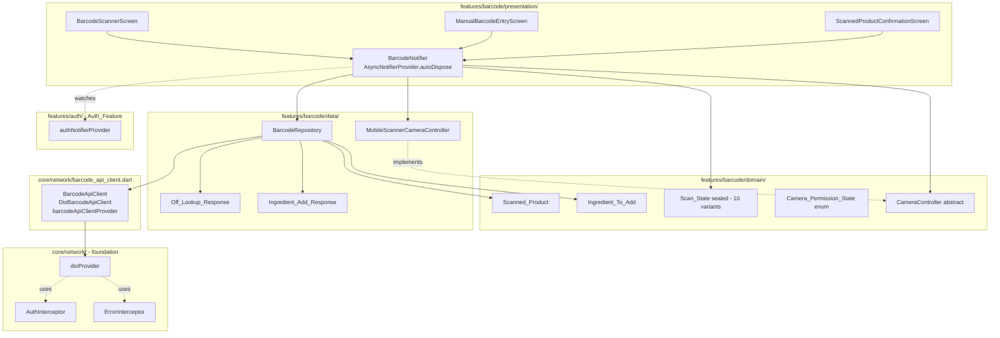

# Design Document

## Overview

This design ports the cook-smart barcode-scan-to-add-ingredient flow from the React Native app under `src/` to the Flutter app under `mobile/`. It is the third spec in the migration, after `flutter-migration-architecture` (Foundation_Phase) and `flutter-port-auth` (Auth_Feature). Every infrastructure, routing, and transport invariant those two specs committed is inherited unchanged. The design that follows describes only what is new for the Barcode_Feature.

The shape of the feature is fixed by the requirements: a Riverpod-driven `BarcodeNotifier` mounted at `mobile/lib/features/barcode/presentation/barcode_notifier.dart`, a `BarcodeRepository` at `mobile/lib/features/barcode/data/barcode_repository.dart`, four domain types (`Scanned_Product`, `Ingredient_To_Add`, `Scan_State`, `Camera_Permission_State`) under `mobile/lib/features/barcode/domain/`, two typed response classes (`Off_Lookup_Response`, `Ingredient_Add_Response`) under `mobile/lib/features/barcode/data/`, three screens under `presentation/`, and a `BarcodeApiClient` transport seam plus its Dio-backed adapter under `mobile/lib/core/network/`.

The feature consumes three external surfaces:

1. The device camera, accessed through `mobile_scanner ^5.1.1` (Foundation Requirement 10.3) on Android. iOS is scaffold-ready (manifest string declared per Requirement 2.2) but parked.
2. The Open Food Facts public REST API at `https://world.openfoodfacts.org/api/v2/product/<barcode>.json` — free, unauthenticated, called with `requiresAuth: false` and a per-request 5s connect / 10s receive timeout override (Requirement 4.2).
3. The cook-smart Backend_API at `POST /api/v1/ingredients` — JWT-authenticated through the foundation's `AuthInterceptor`, called with `requiresAuth: true` and the foundation-default 10s connect / 15s receive timeouts (Requirement 5.1).

The feature adds **zero** new pubspec dependencies (Requirement 13.2). Every package it needs is already pinned by Foundation_Phase (`mobile_scanner`, `cached_network_image`, `url_launcher`, `flutter_riverpod`, `dio`, `go_router`) or by Auth_Feature (`glados ^1.1.6` for property-based tests). It modifies **zero** files under `mobile/lib/core/` (Requirement 13.1) and applies **zero** new `ProviderScope` overrides in `main.dart` (Requirement 8.4) — every provider it adds is local to the feature, and the Auth_Feature's overrides already close every cross-cutting loop the Barcode_Feature depends on (router redirect, 401 clear-and-redirect, JWT injection).

Two architectural choices were already pinned by the requirements and are taken as given here: the transport seam lives under `lib/core/network/` per the pattern established by Auth Decision 4 (Requirement 1.1, 8.1, 13.7), and the cook-smart `POST /api/v1/ingredients` response is parsed locally per Auth Decision 1 rather than through the foundation's `ApiResponse<DataType>` envelope (Requirement 5.4). The remaining decisions — how the camera lifecycle and AppLifecycleState integrate with Riverpod auto-dispose, how barcode-detection callbacks are debounced, how the cross-screen Scan_State is held, and how the parser-strictness vs "Unknown Product" rules interact — are decided in the "Architectural Decisions" section below.

## Architecture

### Layering

The feature follows the foundation's `data/domain/presentation` split that Auth_Feature confirmed:

- **`domain/`** — value types only. `Scanned_Product`, `Ingredient_To_Add`, `Scan_State` (sealed with ten variants), `Camera_Permission_State` (enum), and a small `CameraController` abstract interface (introduced for Requirement 2.12 platform-isolation). No imports from `data/`, `presentation/`, `core/network/`, or `core/storage/`.
- **`data/`** — HTTP and parser layer. `BarcodeRepository` (the only file that calls the seam's two methods), `Off_Lookup_Response` and `Ingredient_Add_Response` (typed parsers for the two real wire shapes), and `MobileScannerCameraController` (the concrete Android implementation of the `CameraController` interface declared in `domain/`). `data/` consumes `core/network/` (via `barcodeApiClientProvider`) and `package:mobile_scanner` (the only file under `features/barcode/` that does, since the camera package is allowed app-wide). It never imports `presentation/`.
- **`presentation/`** — Riverpod notifier and three screens. `BarcodeNotifier` (`AsyncNotifierProvider.autoDispose`), `BarcodeScannerScreen`, `ManualBarcodeEntryScreen`, `ScannedProductConfirmationScreen`. Consumes `domain/` and `data/`. Never imports `package:dio` (script-enforced) and never constructs `Dio(` or `GoRouter(` (script-enforced).
- **`core/network/`** — `barcode_api_client.dart` declares the abstract `BarcodeApiClient`, the concrete `DioBarcodeApiClient`, and the `Provider<BarcodeApiClient>` named `barcodeApiClientProvider`. This file is where `package:dio` lives for the Barcode_Feature (Requirement 1.1, 8.1).

### Module Diagram



### Cross-Cutting Flows

**Authenticated `POST /api/v1/ingredients` lifecycle.** A repository call goes through `barcodeApiClient.addIngredient(body)`; the seam attaches `requiresAuth=true` on `RequestOptions.extra`; `AuthInterceptor` reads the JWT under key `'jwt'` and attaches `Authorization: Bearer …`; the request hits the backend; on `401` the foundation's `ErrorInterceptor` (configured by Auth_Feature with `cookSmartRefreshNotSupported`) clears storage, invokes `authRedirectCallbackProvider`, the router redirects to `/auth/login`, and `AuthNotifier.markSessionExpired` flips `Auth_State` to `AuthUnauthenticated('Your session has expired')`. The repository's awaited future rejects with `UnauthorisedException` already wrapped in `DioException.error`. The `BarcodeNotifier` observes the typed exception, transitions `Scan_State` to `ScanFailed(reason: sessionExpired, ...)` and releases the camera (Requirement 6.5). No file under `core/` is touched; the entire 401 path is closed by Auth_Feature wiring.

**Unauthenticated Open_Food_Facts_API lookup lifecycle.** The repository call sets `requiresAuth=false` so `AuthInterceptor` skips JWT injection. Per-request `Options(connectTimeout: 5s, receiveTimeout: 10s)` overrides the foundation defaults (Requirement 4.2). On 200 the body is JSON-decoded and parsed by `Off_Lookup_Response.fromJson`. Three outcomes are possible: a typed `Scanned_Product` (Requirement 4.4), a typed `ProductNotFound` sentinel (Requirement 4.5, distinguishable from both success and failure), or a thrown `ServerException` for malformed bodies (Requirement 4.6). On non-2xx status the repository raises `ServerException` (Requirement 4.8); on transport failure `ErrorInterceptor` already produced `NetworkException` (Requirement 4.7).

**Camera permission and lifecycle.** When the user invokes the scan action, the `BarcodeNotifier` queries `CameraController.queryPermission()` (defence-in-depth on top of the router-level auth gate per Requirement 6.1–6.2). If the result is `granted`, the notifier asks the controller to start a preview and transitions `Scan_State` to `ScanCameraActive`; otherwise it transitions to `ScanRequestingPermission` then either `ScanCameraActive` or `ScanPermissionDenied(reason: ...)` per the four-way enum. While `ScanCameraActive`, the controller's barcode-detection stream feeds the notifier; the notifier validates each candidate against `^[0-9]{8,13}$` and silently discards invalid ones (Requirement 3.3). On the first valid candidate, the notifier transitions to `ScanLookingUp(barcode)` and starts the Open_Food_Facts_API request. The notifier debounces detection callbacks for the entire `ScanLookingUp`/`ScanProductFound`/`ScanProductNotFound`/`ScanAdding`/`ScanAdded`/`ScanFailed` window (Requirement 9.4, 12.7). On `ScanCameraActive` exit, on `BarcodeScannerScreen` pop, or on `AppLifecycleState.paused`/`inactive`, the notifier asks the controller to release the camera within 500 ms (Requirements 2.7, 2.8, 12.9). On `AppLifecycleState.resumed`, the notifier re-queries permission (Requirement 2.9, 2.10) before re-activation.

**Auto-dispose and request cancellation.** `barcodeNotifierProvider` is `AsyncNotifierProvider<BarcodeNotifier, ScanState>.autoDispose` (Requirement 8.3). When the last `Consumer` watching the notifier unmounts (the user pops `BarcodeScannerScreen`, `ManualBarcodeEntryScreen`, and `ScannedProductConfirmationScreen` off the stack), Riverpod schedules disposal. The notifier registers an `onDispose` callback that (a) cancels any in-flight request via Dio's `CancelToken` (Requirement 8.11), (b) asks the camera controller to release the preview (Requirement 8.10), and (c) marks itself as disposed so any post-disposal stream callback is dropped without state mutation. Because the provider is auto-dispose with no `keepAlive` (Requirement 8.9), navigating away abandons a half-completed Scan_Session — the next entry into the scanner starts in `ScanIdle` with a fresh notifier.


### Sequence: Camera-path scan to add

```mermaid
sequenceDiagram
    participant User
    participant Scanner as BarcodeScannerScreen
    participant Notifier as BarcodeNotifier
    participant Cam as CameraController
    participant Repo as BarcodeRepository
    participant OFF as Open Food Facts API
    participant Confirm as ScannedProductConfirmationScreen
    participant Backend as cook-smart /api/v1/ingredients

    User->>Scanner: open scanner
    Scanner->>Notifier: startSession()
    Notifier->>Notifier: read authNotifierProvider (defence-in-depth)
    Notifier->>Cam: queryPermission()
    Cam-->>Notifier: granted
    Notifier->>Cam: start()
    Notifier-->>Scanner: ScanCameraActive
    Scanner-->>User: viewfinder + "Point camera at barcode"

    Cam-->>Notifier: detected "0123456789012"
    Notifier->>Notifier: validate ^[0-9]{8,13}$ -> ok
    Notifier->>Notifier: debounce future callbacks
    Notifier-->>Scanner: ScanLookingUp(barcode)
    Notifier->>Repo: lookupOpenFoodFacts(barcode)
    Repo->>OFF: GET /api/v2/product/0123456789012.json (5s/10s, requiresAuth=false)
    OFF-->>Repo: 200 {status:1, product:{...}}
    Repo->>Repo: Off_Lookup_Response.fromJson
    Repo-->>Notifier: Scanned_Product
    Notifier-->>Scanner: ScanProductFound(product)
    Scanner->>Confirm: push

    User->>Confirm: edit quantity / unit, tap "Add to Pantry"
    Confirm->>Notifier: confirmAdd(ingredient)
    Notifier-->>Confirm: ScanAdding(ingredient)
    Notifier->>Repo: addIngredient(body)
    Repo->>Backend: POST /api/v1/ingredients (10s/15s, requiresAuth=true)
    Backend-->>Repo: 201 {message, ingredient}
    Repo->>Repo: Ingredient_Add_Response.fromJson
    Repo-->>Notifier: addedIngredientName
    Notifier-->>Confirm: ScanAdded(addedIngredientName)
    Confirm-->>User: success banner
    Confirm->>Scanner: pop
    Scanner->>Scanner: pop
```

## Architectural Decisions

The high-stakes architectural choices were already pinned by the requirements: the transport seam lives in `core/network/` (Auth Decision 4 reused per Requirements 1.1, 8.1, 13.7), the Ingredient_Endpoint response is parsed locally rather than through `ApiResponse<DataType>` (Auth Decision 1 reused per Requirement 5.4), and no override of any foundation provider is added to `main.dart` (Requirement 8.4). Four smaller decisions remain. Each is named, weighed, and committed below.

### Decision 1: Camera lifecycle via a `domain/`-level abstraction, not `mobile_scanner` directly in `presentation/`

**Choice.** Introduce an abstract `CameraController` interface in `mobile/lib/features/barcode/domain/camera_controller.dart` whose surface is `Future<CameraPermissionState> queryPermission()`, `Future<CameraPermissionState> requestPermission()`, `Future<void> start()`, `Future<void> stop()`, and `Stream<String> get rawDetections`. The concrete `MobileScannerCameraController` lives in `mobile/lib/features/barcode/data/mobile_scanner_camera_controller.dart` and is the **only** file under `features/barcode/` that imports `package:mobile_scanner`. The notifier holds a `CameraController` reference, never a `MobileScannerController` directly.

**Why this is necessary.** Requirement 2.12 forbids `if (Platform.isAndroid) ...` branches and demands that platform-specific behaviour, if any, be isolated behind an interface defined in `domain/` and implemented under `data/`. The straightforward "use `MobileScannerController` directly inside the notifier" approach would couple the notifier to a concrete platform plugin and make Requirement 2.12 essentially impossible to satisfy when iOS lands.

**Alternatives considered.**

- **Option B: Use `MobileScannerController` directly inside the notifier.** Rejected by Requirement 2.12. Also makes the notifier almost impossible to unit-test without booting a real Flutter binding (the package's controllers cannot be constructed in a Dart-only test).
- **Option C: Push the abstraction down to `data/` and let the notifier still see `mobile_scanner` types.** Rejected because `data/` would still depend on `package:mobile_scanner` and the abstraction would then have nowhere to live for iOS. Putting the interface in `domain/` is the standard "ports and adapters" position and maps directly onto the requirement.
- **Option D: Skip the abstraction and rely on `Platform.isAndroid` checks plus a future iOS rewrite.** Rejected by the requirement and by basic testability. The whole point of abstracting now is that the iOS spec is a one-file change, not a refactor.

**What this commits.** A four-method abstract `CameraController` in `domain/`, a concrete `MobileScannerCameraController` in `data/` that wraps `MobileScannerController` plus its permission helper, and a `Provider<CameraController>` named `cameraControllerProvider` in `data/mobile_scanner_camera_controller.dart`. The notifier reads the controller via `ref.read(cameraControllerProvider)` and gets fault-injectable behaviour for free in tests. `package:mobile_scanner` appears at exactly one import site under `features/barcode/`.

### Decision 2: Cross-screen state via the autoDispose notifier, scoped at the `BarcodeScannerScreen` boundary

**Choice.** `barcodeNotifierProvider` is `AsyncNotifierProvider<BarcodeNotifier, ScanState>.autoDispose` (Requirement 8.3). The `BarcodeScannerScreen`, the `ScannedProductConfirmationScreen` it pushes, and the `ManualBarcodeEntryScreen` it pushes all watch the same provider, so all three screens share a single notifier instance for the duration of the Scan_Session. When the user pops out of the scanner subtree entirely (back past `BarcodeScannerScreen`), Riverpod auto-disposes; the next entry starts fresh.

**Why this is correct.** Requirements 9.5, 9.6, 9.7, 9.8, 9.9, 10.5, 11.6 all describe state transitions that span two or three screens (camera → confirmation, manual entry → confirmation, confirmation back to camera on validation failure). A new notifier per screen would not be able to hold the resolved `Scanned_Product` from the camera's `ScanProductFound` and hand it to the confirmation screen as `ScanAdding(ingredient)`. A single root-scoped notifier with `keepAlive` would survive navigation away and silently retain state from a previous session — Requirement 8.9 forbids this explicitly. Auto-dispose at the scanner-subtree boundary is the only design that satisfies both the multi-screen state-sharing requirement and the "half-complete sessions do not survive navigation" requirement.

**Alternatives considered.**

- **Option B: Three separate provider families, one per screen, with the user's selections passed by route argument.** Rejected because Requirement 9.7's "Add to Pantry" → `ScanAdding` → `ScanAdded` chain crosses two screens (Confirmation makes the request; Scanner observes the success banner per Requirement 9.9), and route-argument passing is one-way.
- **Option C: A keep-alive root provider plus an explicit `reset()` on screen exit.** Rejected because it relies on the screens to call `reset()` correctly on every exit path (back gesture, app-switch, deep-link, error). Auto-dispose makes the invariant structural: navigating away triggers disposal whether the screen knows or not.
- **Option D: A short-lived family keyed by a session UUID minted on `startSession`.** Rejected as overengineering. The router stack already gives us a "current session" boundary for free; adding a UUID is a layer of indirection no requirement asks for.

**What this commits.** `final AsyncNotifierProviderFamily-style? No — a plain autoDispose:` `final AsyncNotifierProvider<BarcodeNotifier, ScanState> barcodeNotifierProvider = AsyncNotifierProvider.autoDispose<BarcodeNotifier, ScanState>(BarcodeNotifier.new);`. The notifier's `build()` returns `ScanIdle()` synchronously and registers `ref.onDispose` for camera release and `CancelToken.cancel()`.

### Decision 3: Detection debounce in the notifier, not the controller

**Choice.** The `BarcodeNotifier` debounces barcode-detection callbacks: while `Scan_State` is anything other than `ScanCameraActive`, the notifier ignores incoming detection events from the controller's `rawDetections` stream. The controller itself does not stop the camera. This is what Requirement 9.4 mandates ("debounce in the BarcodeNotifier rather than by stopping the camera, so that the camera does not need to be restarted on a 'try again' outcome").

**Why this is correct.** "Try Again" from `ScanProductNotFound` is supposed to feel instant (Requirement 9.5). If we stopped the camera on every transition out of `ScanCameraActive`, the camera would need to re-handshake the device service on every "try again", which on Android can take 500 ms–2 s and visibly stutters the preview. Holding the preview live and gating the consumption of detections at the notifier level keeps the preview seamless. The cost is that the camera is active during `ScanLookingUp`, `ScanProductFound` (which pushes a confirmation screen), and `ScanProductNotFound` (a modal alert) — a few extra seconds of camera-on time, well within the lifecycle-release contract of Requirement 2.8.

**Alternatives considered.**

- **Option B: Stop the camera on `ScanLookingUp`, restart on "Try Again".** Rejected by Requirement 9.4's explicit text and by the UX cost above.
- **Option C: Debounce inside the controller adapter.** Rejected because it leaks Scan_State knowledge into `data/` (the controller would need to know about `ScanLookingUp`), violating the layering rule.

**What this commits.** A single `bool _consumingDetections` field on the notifier, set to `true` only while `Scan_State == ScanCameraActive`. The detection-stream subscription's listener checks the flag first and returns early when `false`. The 1000 ms soft rate limit (Requirement 12.8) is implemented as a separate `DateTime _lastLookupAt` check in the same listener — independent of the consumption gate, so a slow successive-scan from the same camera-on session is deferred rather than dropped.

### Decision 4: Strict parser, lenient `name` resolution

**Choice.** `Off_Lookup_Response.fromJson` is **strict** about the response envelope (top-level `status` field, top-level `product` object) per Requirement 4.6 — any malformed envelope raises `ServerException`. It is **lenient** about the `product` object's contents per Requirement 4.4 and 7.10 — when every documented field (`product_name`, `brands`, `categories`, `image_url`) is missing, empty, or oversized, the parser still produces a `Scanned_Product` whose `name` is the literal string `"Unknown Product"`. The two regimes meet at the contract boundary: the envelope is the API's promise, the per-product fields are best-effort metadata.

**Why this distinction matters.** Requirement 4.6 and Requirement 7.10 look contradictory at first read — one says "raise on malformed body", the other says "construct a Scanned_Product even when every field is missing". The reconciliation is that "malformed" applies to the envelope (`status` not in `{0, 1}`, body not a JSON object, `product` present but not an object), while "every field missing" applies to the inner `product` object's metadata fields, which Open Food Facts genuinely sometimes returns sparse. The React Native predecessor's `productLookupService` makes the same distinction; preserving it is a stated parity goal of Requirement 7.10.

**Alternatives considered.**

- **Option B: Strict throughout — raise `ServerException` if `product_name` is missing or empty.** Rejected because real OFF responses omit `product_name` for newly-uploaded products that haven't been curated yet; the user would see a confusing "lookup failed" for products that exist but are sparsely populated. Worse, it diverges from the RN predecessor's user-visible behaviour for no architectural gain.
- **Option C: Lenient throughout — accept any body shape and default everything to "Unknown".** Rejected because it would mask genuine API regressions (a future OFF response that returned `null` at the top level would silently produce `Scanned_Product(name: "Unknown Product")`), and Requirement 13.6 (b) explicitly demands a property test that "every malformed Open_Food_Facts_API body raises `ServerException`".

**What this commits.** `Off_Lookup_Response.fromJson` validates the envelope eagerly and raises `ServerException` on shape failures (top-level non-object, `status` missing/non-int/outside `{0, 1}`, `product` non-object). Once past the envelope check, the parser builds `Scanned_Product` from whatever fields it finds, applying length caps (200 chars for name/brand/category, 2048 for imageUrl per Requirement 4.4) and the `"Unknown Product"` fallback for `name`. The 512 KiB body-size guard (Requirement 4.3) is applied at the seam level (in `DioBarcodeApiClient`) before the JSON decoder runs, so the parser never sees an oversized body.

### Decision 5: Modal alerts as `presentation/` widgets, retry counters in the notifier

**Choice.** The "Lookup Failed" modal (Requirement 11.4, 11.5) and the "Add Failed" modal (Requirement 11.8) are stateless `AlertDialog` widgets defined inside `barcode_scanner_screen.dart` and `scanned_product_confirmation_screen.dart` respectively. The 3-attempt retry limit per Requirement 11.4 / 11.5 / 11.8 is owned by the `BarcodeNotifier` as private counters: `_lookupRetryCount` (reset on every fresh `submitBarcode`) and `_addRetryCount` (reset on every fresh `confirmAdd`). The screens read the current retry count from `Scan_State`'s `ScanFailed` variant (the variant carries enough information to compute "retries remaining") and disable the `"Retry"` button when the limit is reached.

**Why this is correct.** Requirement 11.4 and 11.5 want the modal closed by user action, not by state mutation; counters held in the notifier are the only place where "retries remaining" survives across user-driven dismissals of the modal. Putting the counters in the screen would lose them on the very dismissals the requirement contemplates.

**Alternatives considered.**

- **Option B: Carry retry counters as fields on `ScanFailed`.** Rejected because `ScanFailed` is shared between camera-path and confirmation-path failures with different counters; encoding both in one variant would either bloat the variant or split it, and Requirement 7.8 pins the variant count at exactly ten.
- **Option C: Carry retry counters as a private map on the notifier keyed by failure category.** Adopted as a refinement of the chosen design — two simple counter fields are clearer than a map for the only two failure categories that have retry limits. The notifier exposes `int retriesRemainingForLookup` and `int retriesRemainingForAdd` as read-only getters used by the screens.

**What this commits.** `BarcodeNotifier` declares two `int _lookupRetryCount = 0` / `int _addRetryCount = 0` private fields, increments them on each retry, and exposes the "retries remaining" via two `int` getters. The notifier resets each counter when its corresponding fresh action is invoked (`submitBarcode` resets `_lookupRetryCount`; `confirmAdd` invoked with a new Ingredient_To_Add resets `_addRetryCount`). The `"Retry"` buttons in the modals read the relevant getter and disable themselves when zero. The tooltip text `"Retry limit reached. Try Manual Entry."` (Requirement 11.4) is the static string the modal renders.


## Components and Interfaces

### `core/network/barcode_api_client.dart` — Transport seam

Mirrors the shape of Auth_Feature's `auth_api_client.dart` (Auth Decision 4) and is the second instance of the feature-shaped transport-seam pattern (Requirement 13.7). Two classes plus a provider, all in one file, all under `lib/core/network/` so that `package:dio` stays confined there.

```text
class BarcodeApiResponse {
  const BarcodeApiResponse({required this.statusCode, required this.body});
  final int statusCode;
  final dynamic body;   // Map<String, dynamic> for ingredient endpoint;
                        // Map<String, dynamic> for OFF; tolerated null for
                        // a 2xx empty body (Requirement 5.6).
}

abstract class BarcodeApiClient {
  Future<BarcodeApiResponse> lookupOpenFoodFacts(
    String barcode, {
    CancelToken? cancelToken,
  });
  Future<BarcodeApiResponse> addIngredient(
    Map<String, dynamic> body, {
    CancelToken? cancelToken,
  });
}

class DioBarcodeApiClient implements BarcodeApiClient {
  DioBarcodeApiClient(this._dio, {void Function(String)? onMalformedAddBody})
      : _onMalformedAddBody = onMalformedAddBody;
  /* ... */
}

final Provider<BarcodeApiClient> barcodeApiClientProvider =
    Provider<BarcodeApiClient>(
  (ref) => DioBarcodeApiClient(ref.read(dioProvider)),
);
```

The `lookupOpenFoodFacts` adapter applies `Options(connectTimeout: const Duration(seconds: 5), receiveTimeout: const Duration(seconds: 10), extra: <String, dynamic>{AuthInterceptor.requiresAuthExtraKey: false})` per Requirement 4.2 and 4.1. It uses an absolute URL (`https://world.openfoodfacts.org/api/v2/product/$barcode.json`) so the foundation's base URL is bypassed. Before JSON-decoding the body it checks the response's `contentLength` (when reported) and, when reading the body as a `String`, asserts `body.length <= 512 * 1024` and raises `ServerException` otherwise (Requirement 4.3).

The `addIngredient` adapter uses the foundation-resolved base URL via the relative path `'/api/v1/ingredients'` and `Options(extra: <String, dynamic>{AuthInterceptor.requiresAuthExtraKey: true})` per Requirement 5.1. The foundation-default 10s/15s timeouts apply (Requirement 12.6). A non-2xx response is unwrapped from `DioException` to the typed `ApiException` already attached by the foundation's `ErrorInterceptor`. A 2xx response with a body that is not a `Map<String, dynamic>` triggers `_onMalformedAddBody?.call(...)` and resolves successfully per Requirement 5.6 — the side effect on the backend has happened, so the user-facing operation is complete.

The seam exposes only these two methods plus the two response types — no other public surface (Requirement 1.1).

### `domain/scanned_product.dart` — `Scanned_Product`

`final class Scanned_Product` with const constructor, value equality across all five fields, and `copyWith` that uses the same "sentinel" pattern Auth_Feature's `User` model established (Requirement 7.3). Field summary:

| Field | Type | Bounds |
|-------|------|--------|
| `barcode` | `String` | matches `^[0-9]{8,13}$` |
| `name` | `String` | 1–200 chars after Requirement 4.4 resolution |
| `brand` | `String?` | 1–200 chars when non-null |
| `category` | `String?` | 1–200 chars when non-null |
| `imageUrl` | `String?` | 1–2048 chars when non-null |

The class also exposes `Map<String, dynamic> toOpenFoodFactsLikeJson()` — a synthesiser that emits the OFF response shape (`{'status': 1, 'product': {'product_name': name, 'brands': brand, 'categories': category, 'image_url': imageUrl}}`) so the Property 1 round-trip test in Requirement 13.6 (a) can encode a generated `Scanned_Product`, decode it through `Off_Lookup_Response.fromJson`, and assert equality. This method is documented as test-fixture support, not a production code path.

### `domain/ingredient_to_add.dart` — `Ingredient_To_Add`

`final class Ingredient_To_Add` with const constructor and value equality across all five fields. Field summary:

| Field | Type | Bounds |
|-------|------|--------|
| `barcode` | `String` | matches `^[0-9]{8,13}$` |
| `customName` | `String` | 1–200 chars after trimming, non-empty after trimming |
| `category` | `String` | 1–100 chars |
| `quantity` | `num` | `0 < quantity <= 9999` |
| `unit` | `String` | 1–32 chars |

Exposes:

- `Map<String, dynamic> toBackendJson()` — emits `{'customName': ..., 'category': ..., 'quantity': ..., 'unit': ..., 'notes': 'Added via barcode scan ($barcode)'}` per Requirement 5.2. Validates every field bound on entry; raises `StateError` identifying the offending field on out-of-bounds values per Requirement 7.6.
- `factory Ingredient_To_Add.fromScannedProduct(Scanned_Product, {num quantity = 1, String unit = 'piece'})` — maps a `Scanned_Product` to defaults per Requirement 7.7. Maps `null` `category` to the literal `'other'`. The method does **not** invoke the bound-checking logic of `toBackendJson()` because Requirement 7.7 is the "happy default" entry point; an explicit `copyWith` override is what surfaces an out-of-bound user input later.

### `domain/scan_state.dart` — `Scan_State`

Sealed family with exactly ten variants in the order pinned by Requirement 7.8. Each variant is `final class` with `const` constructor and value equality (Requirement 7.9):

```text
sealed class ScanState
final class ScanIdle extends ScanState                                  // no payload
final class ScanRequestingPermission extends ScanState                  // no payload
final class ScanPermissionDenied extends ScanState                      // CameraPermissionDenialReason reason
final class ScanCameraActive extends ScanState                          // no payload
final class ScanLookingUp extends ScanState                             // String barcode
final class ScanProductFound extends ScanState                          // ScannedProduct product
final class ScanProductNotFound extends ScanState                       // String barcode
final class ScanAdding extends ScanState                                // IngredientToAdd ingredient
final class ScanAdded extends ScanState                                 // String? addedIngredientName
final class ScanFailed extends ScanState                                // ScanFailureReason reason, String description

enum CameraPermissionDenialReason { denied, permanentlyDenied, unavailable }
enum ScanFailureReason { network, server, validation, notAuthenticated, sessionExpired, cameraUnavailable }
```

The full state-transition diagram is in the "Data Models" section below.

### `domain/camera_permission_state.dart` — `Camera_Permission_State`

```text
enum CameraPermissionState { granted, denied, permanentlyDenied, unavailable }
```

Mirrors the four-way distinction the React Native `barcodeService` already makes (Glossary).

### `domain/camera_controller.dart` — `CameraController`

Abstract interface introduced by Decision 1 to satisfy Requirement 2.12.

```text
abstract class CameraController {
  Future<CameraPermissionState> queryPermission();
  Future<CameraPermissionState> requestPermission();
  Future<void> start();
  Future<void> stop();
  Stream<String> get rawDetections;   // emits the digit string of every detected barcode
                                       // candidate, regardless of validity
}
```

The interface is the only thing under `domain/` whose method signatures involve a side-effecting `Future`. It exists because the requirement demands platform-specific behaviour live behind a domain-level interface, not because the abstraction has multiple useful implementations today; the only production implementation is `MobileScannerCameraController`. A second implementation may land when iOS does.

### `data/mobile_scanner_camera_controller.dart` — concrete `CameraController`

Wraps `MobileScannerController` (from `package:mobile_scanner ^5.1.1`) with the mapping rules:

- `queryPermission()` and `requestPermission()` delegate to the package's permission helpers and translate the package's permission enum to `CameraPermissionState`.
- `start()` constructs/starts the underlying `MobileScannerController` with the format set restricted to `{BarcodeFormat.ean8, BarcodeFormat.ean13, BarcodeFormat.upcA, BarcodeFormat.upcE}` per Requirement 3.2 (no QR detection).
- `stop()` calls `dispose()` on the underlying controller and completes within 500 ms (Requirement 2.8).
- `rawDetections` is exposed as a broadcast `Stream<String>` derived from the package's barcode-detection callback, emitting the raw `rawValue` of each detected `Barcode` event without filtering.

Exposes `final Provider<CameraController> cameraControllerProvider = Provider.autoDispose<CameraController>((ref) { final controller = MobileScannerCameraController(); ref.onDispose(controller.stop); return controller; });` so that the controller's lifetime tracks the notifier's. This is the only file under `features/barcode/` that imports `package:mobile_scanner`.

### `data/off_lookup_response.dart` — `Off_Lookup_Response`

`final class Off_Lookup_Response` whose `fromJson(Map<String, dynamic>, String barcode)` factory implements Decision 4's strict-envelope/lenient-product rule. The factory produces one of two outcomes via a sealed `OffLookupOutcome` family:

```text
sealed class OffLookupOutcome
final class OffLookupProduct extends OffLookupOutcome   // ScannedProduct product
final class OffLookupNotFound extends OffLookupOutcome  // String barcode
```

`Off_Lookup_Response.fromJson` raises `ServerException` (with a message identifying the offending barcode and the offending field, per Requirement 4.6) when the envelope is malformed, and returns `OffLookupOutcome` otherwise. `OffLookupNotFound` is the typed sentinel Requirement 4.5 demands — distinguishable from both success (`OffLookupProduct`) and failure (an exception).

### `data/ingredient_add_response.dart` — `Ingredient_Add_Response`

`final class Ingredient_Add_Response` whose `fromJson(dynamic body)` factory reads the optional top-level `message` (`String?`) and optional top-level `ingredient` (`Map<String, dynamic>?`) fields per Requirement 5.4. Resolves to a value type with two nullable fields. When the body is not a `Map`, when `message` is non-string, or when `ingredient` is non-object, the factory **does not throw** — Requirement 5.6 makes this the single "lenient parsing" surface in the feature, because the side effect on the backend has already occurred. Instead, the factory returns `Ingredient_Add_Response(message: null, ingredient: null)` and notifies the optional `void Function(String)` logging hook installed via the `DioBarcodeApiClient` constructor.

The notifier reads `Ingredient_Add_Response.ingredient?['custom_name'] as String?` (the field name `backend/src/routes/ingredients.ts` returns) and falls back to the Scanned_Product's `name` if absent, populating `ScanAdded.addedIngredientName` per Requirement 9.9.

### `data/barcode_repository.dart` — `BarcodeRepository`

```text
class BarcodeRepository {
  BarcodeRepository(this._client);

  Future<OffLookupOutcome> lookupOpenFoodFacts(
    String barcode, {
    CancelToken? cancelToken,
  });

  Future<IngredientAddResponse> addIngredient(
    IngredientToAdd ingredient, {
    CancelToken? cancelToken,
  });
}

final Provider<BarcodeRepository> barcodeRepositoryProvider = Provider(
  (ref) => BarcodeRepository(ref.read(barcodeApiClientProvider)),
);
```

`lookupOpenFoodFacts` validates the input against `^[0-9]{8,13}$` **before** calling the seam (Requirement 13.6 (c)) — an invalid barcode raises a synchronous `ArgumentError` (caught by the notifier and translated to the inline error per Requirement 3.5) and produces no HTTP request. On a valid barcode it calls `_client.lookupOpenFoodFacts(barcode, cancelToken: ...)` and feeds the resulting body to `Off_Lookup_Response.fromJson`, returning the `OffLookupOutcome`. Transport failures pass through as the typed `ApiException` already produced by the foundation's `ErrorInterceptor` — the repository does not wrap them.

`addIngredient` calls `ingredient.toBackendJson()` to build the body (the bound checks are guaranteed to pass because the notifier enforces the same bounds at confirmation time, but `toBackendJson()` re-checks defensively per Requirement 7.6) and passes it to `_client.addIngredient(body, cancelToken: ...)`. On success, `Ingredient_Add_Response.fromJson` parses the body. The repository raises no errors of its own; every error is the typed `ApiException` produced by the foundation.

The repository never imports `package:flutter_secure_storage` or any file under `features/auth/` (Requirement 6.6, 6.7). Auth state interactions happen through the seam's `requiresAuth` flag, full stop.

### `presentation/barcode_notifier.dart` — `BarcodeNotifier`

```text
final AsyncNotifierProvider<BarcodeNotifier, ScanState> barcodeNotifierProvider =
    AsyncNotifierProvider.autoDispose<BarcodeNotifier, ScanState>(BarcodeNotifier.new);

class BarcodeNotifier extends AutoDisposeAsyncNotifier<ScanState> {
  @override
  Future<ScanState> build() {
    ref.listen(authNotifierProvider, _onAuthStateChanged);
    ref.onDispose(_handleDispose);
    return Future.value(const ScanIdle());
  }

  Future<void> startSession();        // entry from BarcodeScannerScreen
  Future<void> submitBarcode(String);  // entry from ManualBarcodeEntryScreen
                                       //   AND from camera detection
  Future<void> confirmAdd(IngredientToAdd ingredient);
  void retryLookup();                  // for the "Retry" button (Requirement 11.4)
  void retryAdd();                     // for the "Retry" button (Requirement 11.8)
  void resetToCameraActive();          // for "Try Again" (Requirement 9.5)
  Future<void> reset();                // returns to ScanIdle, releasing camera
  int get retriesRemainingForLookup;   // Decision 5
  int get retriesRemainingForAdd;
}
```

`build()` returns `ScanIdle()` synchronously (Requirement 8.7), wires a listener for `authNotifierProvider` (Requirement 6.5), and registers the disposal handler. The listener checks `next.valueOrNull` against `AuthAuthenticated`; on any other value while a Scan_Session is in flight it transitions state to `ScanFailed(reason: sessionExpired, ...)` and calls `_camera.stop()`.

`startSession` is the entry point that drives the camera-permission cascade. It first reads `authNotifierProvider` once for the defence-in-depth check (Requirement 6.3, 6.4): if not `AuthAuthenticated`, it transitions to `ScanFailed(reason: notAuthenticated, ...)` and returns. Otherwise it calls `_camera.queryPermission()`; on `granted` it transitions to `ScanCameraActive` and starts the controller; on `denied` and never-requested-before it transitions to `ScanRequestingPermission` and calls `_camera.requestPermission()`; on `permanentlyDenied` or `unavailable` it transitions to `ScanPermissionDenied(reason)` per Requirement 2.5/2.6/2.10.

`submitBarcode` is shared between the camera detection callback and the manual-entry submit handler (Requirement 10.5 — one code path). It validates the input against `^[0-9]{8,13}$` first (Requirement 3.4, 10.4); on failure (manual-entry only — camera-path detections that fail validation are dropped silently per Requirement 3.3) it sets state to `ScanCameraActive` (or stays in `ScanIdle` for manual entry, with the inline error rendered in the screen via a separate provider). On success it applies the soft 1 Hz rate limit (Requirement 12.8 — defer if `DateTime.now() - _lastLookupAt < Duration(seconds: 1)`), then transitions to `ScanLookingUp(barcode)` and calls `_repo.lookupOpenFoodFacts(barcode, cancelToken: _cancelToken)`. The future's outcome is mapped: `OffLookupProduct` → `ScanProductFound(product)`; `OffLookupNotFound` → `ScanProductNotFound(barcode)`; `NetworkException` → `ScanFailed(reason: network, ...)` with `_lookupRetryCount` incremented; `ServerException` → `ScanFailed(reason: server, ...)` with `_lookupRetryCount` incremented.

`confirmAdd` transitions to `ScanAdding(ingredient)`, calls `_repo.addIngredient(ingredient, cancelToken: _cancelToken)`, and maps the outcome: success → `ScanAdded(addedIngredientName)`; `ValidationException` → `ScanFailed(reason: validation, ...)`; `UnauthorisedException` → `ScanFailed(reason: sessionExpired, ...)` (this path coexists with the Auth_Notifier-driven router redirect — the screen will be unmounted by the redirect before the user sees the failed state); `ServerException` / `NetworkException` → `ScanFailed(reason: server | network, ...)` with `_addRetryCount` incremented.

`_handleDispose` cancels `_cancelToken`, calls `_camera.stop()`, and unsubscribes the auth-state listener. After this method runs, every `state =` assignment is a no-op (guarded by a `_disposed` flag) per Requirement 8.11.

### `presentation/barcode_scanner_screen.dart` — `BarcodeScannerScreen`

`ConsumerWidget` that watches `barcodeNotifierProvider` and renders one of:

- `ScanIdle` → tap-to-start CTA (in practice the screen calls `notifier.startSession()` from a post-frame callback after first build, so users rarely see this).
- `ScanRequestingPermission` → spinner.
- `ScanPermissionDenied(reason)` → inline error region per Requirement 11.1, 11.2, 11.3 with the appropriate button (`"Grant Permission"` / `"Open Settings"` / `"Use Manual Entry"`).
- `ScanCameraActive` → camera preview + viewfinder + instruction text per Requirement 9.1. The viewfinder corner colour, instruction text colour, and other tokens come from `app_colours.dart` (Requirement 1.7).
- `ScanLookingUp(barcode)` → preview + a non-blocking centred loading card with `"Looking up product..."` per Requirement 9.3.
- `ScanProductNotFound(barcode)` → preview + the modal alert per Requirement 9.5.
- `ScanFailed(reason: network|server, ...)` → preview + the "Lookup Failed" modal per Requirement 11.4/11.5, with the `"Retry"` button gated on `notifier.retriesRemainingForLookup`.
- `ScanFailed(reason: cameraUnavailable, ...)` → inline error region.
- `ScanFailed(reason: notAuthenticated, ...)` → blank (the router redirect kicks in immediately; this state is observed only in tests).
- `ScanFailed(reason: sessionExpired, ...)` → blank (the Auth_Feature's router redirect navigates away).
- Other `ScanFailed` reasons or `ScanProductFound` / `ScanAdding` / `ScanAdded` → the screen pushes the confirmation route or pops back; no in-place rendering.

Bottom controls: two buttons per Requirement 9.10 (`"Cancel"`, `"Manual Entry"`), interactive in every state except `ScanAdding` (which the user never sees on this screen anyway because confirmation has already pushed). On screen pop (Requirement 9.11) the screen calls `notifier.reset()` from a `WillPopScope` / `PopScope` hook — but the `autoDispose` provider also handles cleanup if the user takes an unusual path. The screen registers itself as a `WidgetsBindingObserver` to receive `AppLifecycleState` events and forwards `paused`/`inactive`/`resumed` to the notifier so it can pause/resume the camera per Requirements 2.7, 2.8, 2.9, 2.10.

The screen never uses `FutureBuilder` (Requirement 9.12), reads scan state via `AsyncValue<T>.when` with non-null callbacks for each branch (Requirement 8.6), and contains no `Color(...)` literal (Requirement 1.7).

### `presentation/manual_barcode_entry_screen.dart` — `ManualBarcodeEntryScreen`

`ConsumerStatefulWidget` because the input field's `TextEditingController` and the inline error message are local UI state. Renders:

- A digit-only `TextField` with `keyboardType: TextInputType.number`, `maxLength: 13`, label `"Enter Barcode"`, and a `FilteringTextInputFormatter.digitsOnly` so non-digit characters are silently dropped at insertion (Requirement 10.1, 3.6).
- A `"Lookup Product"` submit button disabled when the input is empty or while `Scan_State == ScanLookingUp` (Requirement 10.2). A small `CircularProgressIndicator` next to the button is shown while in `ScanLookingUp` (Requirement 10.2).
- An informational note above the input field rendering `"Camera is unavailable; enter the barcode by hand."` when the screen is reached because of `Camera_Permission_State == unavailable` (Requirement 10.9). The screen reads the relevant flag from a route argument passed by the scanner.
- Inline error region(s) per Requirement 10.4 (regex failure: `"Barcode must be 8 to 13 digits"`), Requirement 10.6 (product-not-found message), and Requirement 10.8 (network/server failure). The error clears whenever the input changes or a new submit is initiated.

On submit the screen calls `notifier.submitBarcode(controller.text)`. It does **not** push the confirmation screen itself — the scanner screen does, in response to `ScanProductFound`. Manual entry stays mounted underneath the confirmation route so navigation back lands on the manual-entry screen with the input preserved.

### `presentation/scanned_product_confirmation_screen.dart` — `ScannedProductConfirmationScreen`

`ConsumerStatefulWidget` because `quantity` and `unit` are user-editable. Reads `Scan_State`; renders only when the state is `ScanProductFound(product)`, `ScanAdding(ingredient)`, `ScanAdded(_)`, or `ScanFailed` with a confirmation-relevant reason.

- Hero region: `name`, `brand` (when non-null), `category` (when non-null), `imageUrl` rendered through `cached_network_image ^3.3.1` (Foundation Requirement 10.7) when non-null.
- Editable form: `quantity` `TextFormField` (default `1`, validated for `> 0 && <= 9999`) and `unit` `TextFormField` (default `"piece"`, max 32 chars).
- Primary button `"Add to Pantry"`, disabled while `Scan_State == ScanAdding` (Requirement 9.7).
- On `ScanAdded`, a non-blocking success banner with `"<addedIngredientName> has been added to your inventory"` text (Requirement 9.9) is rendered for 3 seconds; the screen and its parents pop within 1 second of the transition.
- On `ScanFailed(reason: validation, ...)`, the validation message renders as an inline error above the form, the form is re-enabled, and the user's typed `quantity` / `unit` are preserved (Requirement 11.6, 9.8).
- On `ScanFailed(reason: server | network, ...)` from the add path, the "Add Failed" modal renders (Requirement 11.8) with the same retry-counter gating as the lookup-failure modal.


## Data Models

### `Scanned_Product`

| Field | Type | Source | Bounds |
|-------|------|--------|--------|
| `barcode` | `String` | Camera detection or manual-entry input, validated against `^[0-9]{8,13}$` | 8–13 ASCII digits |
| `name` | `String` | OFF `product.product_name`; falls back to `"Unknown Product"` per Requirement 4.4 / 7.10 | 1–200 chars after trimming |
| `brand` | `String?` | First comma-separated entry of OFF `product.brands` after trimming | 1–200 chars or `null` |
| `category` | `String?` | First comma-separated entry of OFF `product.categories` after trimming | 1–200 chars or `null` |
| `imageUrl` | `String?` | OFF `product.image_url` verbatim | 1–2048 chars or `null` |

The `toOpenFoodFactsLikeJson()` method emits the OFF response shape so Property 1 (round-trip) can encode and decode through `Off_Lookup_Response.fromJson` and assert equality. The method is documented as test-fixture support.

### `Ingredient_To_Add`

| Field | Type | Default (when constructed via `fromScannedProduct`) | Bounds |
|-------|------|------------------------------------------------------|--------|
| `barcode` | `String` | from `Scanned_Product.barcode` | 8–13 ASCII digits |
| `customName` | `String` | from `Scanned_Product.name` | 1–200 chars after trimming |
| `category` | `String` | from `Scanned_Product.category` or `'other'` | 1–100 chars |
| `quantity` | `num` | `1` | `0 < quantity <= 9999` |
| `unit` | `String` | `'piece'` | 1–32 chars |

`toBackendJson()` re-validates every bound and raises `StateError` identifying the offending field on failure (Requirement 7.6). The synthesised `notes` field always reads `"Added via barcode scan ($barcode)"` and contributes to the 500-char total cap on the body (Requirement 5.2).

### Persisted shape on the wire

**Outgoing — `POST /api/v1/ingredients`** (Requirement 5.2):

```json
{
  "customName": "Heinz Ketchup",
  "category": "condiments",
  "quantity": 1,
  "unit": "piece",
  "notes": "Added via barcode scan (0123456789012)"
}
```

**Incoming — Open Food Facts product success** (Requirement 4.3, 4.4):

```json
{
  "status": 1,
  "product": {
    "product_name": "Heinz Tomato Ketchup",
    "brands": "Heinz",
    "categories": "Condiments, Tomato sauces",
    "image_url": "https://images.openfoodfacts.org/.../front_en.jpg"
  }
}
```

**Incoming — Open Food Facts product not found** (Requirement 4.5):

```json
{
  "status": 0,
  "code": "0000000000000"
}
```

**Incoming — `POST /api/v1/ingredients` 201** (Requirement 5.4):

```json
{
  "message": "Ingredient added successfully",
  "ingredient": {
    "id": 4711,
    "custom_name": "Heinz Ketchup",
    "category": "condiments",
    "quantity": 1,
    "unit": "piece"
  }
}
```

The Barcode_Feature does not write to `SecureStorage`. The JWT and user record continue to be owned exclusively by Auth_Feature (Requirement 6.6).

### Scan_State transition diagram

The diagram below shows every valid transition between the ten variants pinned by Requirement 7.8, with the trigger that drives each transition.

```mermaid
stateDiagram-v2
    [*] --> ScanIdle: provider built

    ScanIdle --> ScanFailed_notAuthenticated: startSession AND auth != AuthAuthenticated
    ScanIdle --> ScanRequestingPermission: startSession AND auth ok AND permission == denied AND never requested
    ScanIdle --> ScanCameraActive: startSession AND auth ok AND permission == granted
    ScanIdle --> ScanPermissionDenied_denied: startSession AND auth ok AND permission == denied AND already requested
    ScanIdle --> ScanPermissionDenied_permanentlyDenied: startSession AND auth ok AND permission == permanentlyDenied
    ScanIdle --> ScanPermissionDenied_unavailable: startSession AND auth ok AND permission == unavailable
    ScanIdle --> ScanLookingUp: submitBarcode (manual-entry path) AND barcode valid

    ScanRequestingPermission --> ScanCameraActive: requestPermission resolves to granted
    ScanRequestingPermission --> ScanPermissionDenied_denied: requestPermission resolves to denied
    ScanRequestingPermission --> ScanPermissionDenied_permanentlyDenied: requestPermission resolves to permanentlyDenied
    ScanRequestingPermission --> ScanPermissionDenied_unavailable: requestPermission resolves to unavailable

    ScanPermissionDenied_denied --> ScanRequestingPermission: user taps "Grant Permission"
    ScanPermissionDenied_permanentlyDenied --> ScanIdle: user returns from Settings AND lifecycle resumed AND permission re-queried
    ScanPermissionDenied_unavailable --> [*]: user pushes ManualBarcodeEntryScreen (notifier kept alive)

    ScanCameraActive --> ScanLookingUp: camera detects valid barcode
    ScanCameraActive --> ScanIdle: notifier.reset OR screen pop OR lifecycle paused
    ScanCameraActive --> ScanFailed_cameraUnavailable: camera controller surfaces hard failure
    ScanCameraActive --> ScanFailed_sessionExpired: authNotifier emits AuthUnauthenticated

    ScanLookingUp --> ScanProductFound: lookupOpenFoodFacts returns OffLookupProduct
    ScanLookingUp --> ScanProductNotFound: lookupOpenFoodFacts returns OffLookupNotFound
    ScanLookingUp --> ScanFailed_network: NetworkException
    ScanLookingUp --> ScanFailed_server: ServerException
    ScanLookingUp --> ScanFailed_sessionExpired: authNotifier emits AuthUnauthenticated mid-lookup

    ScanProductFound --> ScanAdding: confirmAdd
    ScanProductFound --> ScanCameraActive: user dismisses confirmation (back gesture)
    ScanProductFound --> ScanFailed_sessionExpired: authNotifier emits AuthUnauthenticated

    ScanProductNotFound --> ScanCameraActive: user taps "Try Again"
    ScanProductNotFound --> ScanIdle: user taps "Manual Entry" (route push, notifier kept alive)

    ScanAdding --> ScanAdded: addIngredient succeeds
    ScanAdding --> ScanFailed_validation: ValidationException (400 or other 4xx)
    ScanAdding --> ScanFailed_server: ServerException (5xx or transport)
    ScanAdding --> ScanFailed_network: NetworkException
    ScanAdding --> ScanFailed_sessionExpired: UnauthorisedException (401, also drives router redirect)

    ScanAdded --> [*]: screens pop within 1s; notifier auto-disposes

    ScanFailed_network --> ScanLookingUp: user taps "Retry" AND retriesRemainingForLookup > 0
    ScanFailed_network --> ScanAdding: user taps "Retry" on Add Failed AND retriesRemainingForAdd > 0
    ScanFailed_server --> ScanLookingUp: user taps "Retry" AND retriesRemainingForLookup > 0
    ScanFailed_server --> ScanAdding: user taps "Retry" on Add Failed AND retriesRemainingForAdd > 0
    ScanFailed_validation --> ScanProductFound: user edits form (state remains ScanProductFound for re-submit; ScanFailed cleared by next confirmAdd)
    ScanFailed_cameraUnavailable --> ScanIdle: user taps "Use Manual Entry" or "Cancel"
    ScanFailed_notAuthenticated --> [*]: router redirects to /auth/login
    ScanFailed_sessionExpired --> [*]: router redirects to /auth/login
```

State labels with `_` suffixes (e.g. `ScanFailed_network`) denote the `ScanFailed` variant with the corresponding `ScanFailureReason`; the runtime type is the same `ScanFailed` class. Self-loops (e.g. an invalid camera detection while in `ScanCameraActive`) are not drawn because they are not transitions — Requirement 3.3 explicitly requires those events to leave state untouched.


## Correctness Properties

*A property is a characteristic or behaviour that should hold true across all valid executions of a system — essentially, a formal statement about what the system should do. Properties serve as the bridge between human-readable specifications and machine-verifiable correctness guarantees.*

The acceptance criteria fall into three buckets after the prework analysis: 12 universal properties (this section), a set of EXAMPLE / EDGE_CASE / INTEGRATION criteria covered in the Testing Strategy below, and structural invariants enforced by the four `tool/check_*.dart` scripts. The 12 properties consolidate every input-varying rule in the spec; redundant pairs were merged so each property below carries unique validation value. Property 1, Property 2, and Property 4 satisfy Requirement 13.6 (a), (b), and (c) respectively.

### Property 1: OFF round-trip

*For any* `Scanned_Product` whose field values are within the bounds documented in Requirement 7 (`barcode` matching `^[0-9]{8,13}$`, `name` 1–200 chars, `brand`/`category` 1–200 chars or null, `imageUrl` 1–2048 chars or null), encoding the Scanned_Product into the Open Food Facts response shape via `Scanned_Product.toOpenFoodFactsLikeJson()` and decoding it back through `Off_Lookup_Response.fromJson(jsonMap, scannedProduct.barcode)` produces an `OffLookupProduct` whose `product` is value-equal to the original Scanned_Product, and the seam observes a single `GET https://world.openfoodfacts.org/api/v2/product/$barcode.json` request with `requiresAuth=false` per call.

**Validates: Requirements 4.1, 4.4, 7.1, 7.2, 7.10, 13.6**

### Property 2: OFF parser strictness

*For any* JSON body that is structurally malformed against the Open Food Facts envelope — including bodies whose top level is not a JSON object, bodies whose `status` field is missing, non-integer, or outside `{0, 1}`, bodies whose `product` field is present but not a JSON object, and bodies that exceed 512 KiB after serialisation — `Off_Lookup_Response.fromJson` (or, for the size case, the `DioBarcodeApiClient` size guard) raises `ServerException` whose message identifies both the offending barcode and the offending field, and the repository does not produce an `OffLookupProduct` or an `OffLookupNotFound`.

**Validates: Requirements 4.3, 4.6, 13.6**

### Property 3: OFF outcome dispatch

*For any* HTTP response from the Open Food Facts API characterised by a tuple `(statusCode, body)` drawn from {2xx with a well-formed `status==1` product body, 2xx with a `status==0` body, 2xx with `status==1` and missing/null `product`, non-2xx status with any body, transport-error event}, the `BarcodeRepository.lookupOpenFoodFacts` outcome dispatches to exactly one of: `OffLookupProduct(scannedProduct)` for the well-formed-product case, `OffLookupNotFound(barcode)` for the two not-found shapes, `ServerException(...)` for non-2xx statuses (without the body being parsed), and `NetworkException(...)` for transport errors (without an automatic retry being issued).

**Validates: Requirements 4.5, 4.7, 4.8**

### Property 4: Barcode validation rejection

*For any* string drawn from the union of {empty, whitespace-only, fewer than 8 ASCII digits, more than 13 ASCII digits, contains a non-digit, contains internal whitespace, contains a leading or trailing whitespace, contains punctuation}, the validator used by `BarcodeRepository.lookupOpenFoodFacts` rejects the input and the repository issues zero HTTP requests; *for any* string of 8 to 13 ASCII digits with no other characters, the validator accepts the input. The same validator gates the camera path (silent discard per Requirement 3.3) and the manual-entry path (inline error per Requirement 3.5).

**Validates: Requirements 3.1, 3.3, 3.4, 3.5, 13.6**

### Property 5: Ingredient_To_Add construction and serialization

*For any* `(Scanned_Product, num quantity, String unit)` triple where the Scanned_Product is valid per Property 1's bounds, `quantity` satisfies `0 < quantity <= 9999`, and `unit` has length 1–32 chars, `Ingredient_To_Add.fromScannedProduct(product, quantity: quantity, unit: unit)` returns an `Ingredient_To_Add` whose `category` equals the product's category when non-null and the literal `'other'` when null, whose other fields equal the corresponding source values, and whose `toBackendJson()` returns a `Map<String, dynamic>` containing exactly the five keys `{customName, category, quantity, unit, notes}` with their documented types and values, with `notes` equal to `"Added via barcode scan ($barcode)"`. *For any* `Ingredient_To_Add` constructed with one field perturbed outside its documented bounds (`customName` empty after trimming, `quantity <= 0` or `> 9999`, `unit` longer than 32 chars, or `category` longer than 100 chars), `toBackendJson()` raises `StateError` whose message identifies the offending field and emits no JSON body.

**Validates: Requirements 5.2, 7.4, 7.5, 7.6, 7.7**

### Property 6: Backend HTTP-status taxonomy

*For any* HTTP response from the cook-smart Ingredient_Endpoint characterised by a tuple `(statusCode, body)` where `statusCode` is drawn from `{200, 201, 202, 400, 401, 403, 404, 409, 422, 429, 500, 502, 503, 504}` and `body` is an arbitrary JSON value, the outcome of `BarcodeRepository.addIngredient` dispatches to exactly one of: success (any 2xx with `Ingredient_Add_Response` parsed leniently per Requirement 5.6), `ValidationException(...)` for 400 (with the message composed from `error` and `details` per Requirement 5.7) or any other 4xx not in `{401}` (with the status and barcode in the message), `UnauthorisedException(...)` for 401 (raised by the foundation's `ErrorInterceptor`), or `ServerException(...)` for any 5xx (with the status and barcode in the message). On every successful 2xx outcome no value is written to `SecureStorage` and no local cache is populated.

**Validates: Requirements 5.3, 5.4, 5.5, 5.6, 5.7, 5.9, 5.10, 12.6**

### Property 7: Request URL allow-list

*For any* sequence of user actions on the Barcode_Feature drawn from `{startSession, submitBarcode(any string), confirmAdd(any IngredientToAdd), retryLookup, retryAdd, reset, screen pop, lifecycle event}`, the set of HTTP request URLs observed at the `BarcodeApiClient` seam is a subset of `{ "https://world.openfoodfacts.org/api/v2/product/<8-13-digit-barcode>.json", "<base>/api/v1/ingredients" }`. No request to the cook-smart `/api/v1/barcode/lookup/:barcode`, `/api/v1/barcode/scan-to-pantry`, `/api/v1/ingredients/custom`, `/api/v1/ingredients/search`, or `/api/v1/ingredients/pantry` paths is observed.

**Validates: Requirements 4.10, 5.12**

### Property 8: startSession permission/auth gate

*For any* `(CameraPermissionState, AuthState)` pair drawn from the four-element permission enum cross the three Auth_Feature variants `{AuthLoading, AuthUnauthenticated, AuthAuthenticated}`, calling `BarcodeNotifier.startSession` once on a freshly built notifier produces a final `Scan_State` and a sequence of camera-controller calls that match exactly: `AuthState != AuthAuthenticated` → final state is `ScanFailed(reason: notAuthenticated, ...)` and zero camera calls are issued; `AuthAuthenticated` and permission `granted` → `ScanCameraActive` and exactly one `camera.start()` call; `AuthAuthenticated` and permission `denied` (with `cameraPermissionEverRequested == false`) → final state is `ScanCameraActive` (after permission grant) or `ScanPermissionDenied(reason: denied)` (after permission denial), with a single `requestPermission()` call and `camera.start()` only when the request resolved to granted; `AuthAuthenticated` and permission `permanentlyDenied` or `unavailable` → corresponding `ScanPermissionDenied` variant and zero `camera.start()` calls.

**Validates: Requirements 2.3, 6.3, 6.4**

### Property 9: Camera lifecycle invariants

*For any* sequence of inputs drawn from `{startSession, screen pop, AppLifecycleState transition (paused, inactive, resumed), notifier dispose}` issued against an authenticated session with permission granted, the following invariants hold throughout the trace: at every observation point the `MobileScannerCameraController`'s `start()`-minus-`stop()` count is in `{0, 1}`; every transition that exits `ScanCameraActive` (screen pop, paused, inactive, dispose, transition to a non-`ScanCameraActive` Scan_State) is followed by a `camera.stop()` call within 500 ms of the transition; every `resumed` event while the scanner screen is on top is preceded by a fresh `queryPermission()` call before any `camera.start()` is issued.

**Validates: Requirements 2.7, 2.8, 2.9, 2.10, 8.10, 9.11, 12.9**

### Property 10: Failure-event response from in-flight states

*For any* in-flight Scan_State drawn from `{ScanRequestingPermission, ScanCameraActive, ScanLookingUp, ScanProductFound, ScanProductNotFound, ScanAdding}` and any failure event drawn from `{AuthNotifier emits AuthUnauthenticated, addIngredient throws an arbitrary ApiException subtype, notifier is disposed}`, the post-event observations satisfy: an `AuthUnauthenticated` emission produces a final state of `ScanFailed(reason: sessionExpired, ...)` and exactly one `camera.stop()` call (when the camera was active); an `addIngredient` exception produces a final state of `ScanFailed` whose `reason` matches the exception subtype (`ValidationException → validation`, `UnauthorisedException → sessionExpired`, `ServerException → server`, `NetworkException → network`) and the user's typed `quantity` and `unit` are not mutated; a notifier disposal cancels any in-flight request via the registered `CancelToken` within 500 ms and produces no further `state =` writes after the dispose callback returns.

**Validates: Requirements 6.5, 8.11, 9.8**

### Property 11: Retry counter monotonicity

*For any* sequence of identical-input failed `lookupOpenFoodFacts` calls, the notifier's `retriesRemainingForLookup` is monotonically non-increasing across the sequence, is `3` immediately after the first failure, never drops below `0`, and the modal's `"Retry"` button is disabled if and only if `retriesRemainingForLookup == 0`. *For any* sequence of identical-input failed `addIngredient` calls, the notifier's `retriesRemainingForAdd` satisfies the same invariants. A fresh `submitBarcode` call resets `retriesRemainingForLookup` to `3`; a fresh `confirmAdd` call with a different `Ingredient_To_Add` resets `retriesRemainingForAdd` to `3`.

**Validates: Requirements 11.4, 11.5, 11.8**

### Property 12: Scanned_Product copyWith preserves all non-overridden fields

*For any* `Scanned_Product` and any single field name `F` drawn from `{barcode, name, brand, category, imageUrl}` and any value-of-correct-type `newValue`, `product.copyWith(F: newValue)` returns a Scanned_Product whose `F` field equals `newValue` and whose every other field equals the corresponding field on the original `product`; `product.copyWith()` (no arguments) returns a value equal to `product`. The sentinel pattern (Requirement 7.3) ensures the property holds when `newValue` is explicitly `null` for a nullable field.

**Validates: Requirements 7.3**


## Error Handling

### Typed exception surface

The Barcode_Feature consumes the foundation's sealed `ApiException` hierarchy and adds nothing to it. Every error raised by `BarcodeRepository` is one of:

- `NetworkException` — transport, DNS, timeout (raised by the foundation's `ErrorInterceptor`). Applies to both the OFF endpoint (after the per-request 5s/10s budget) and the Ingredient_Endpoint (after the foundation-default 10s/15s budget).
- `UnauthorisedException` — Backend_API `401` (raised by the foundation's `ErrorInterceptor` after the Auth_Feature's `cookSmartRefreshNotSupported` stub fails). Cannot occur for OFF requests because they set `requiresAuth=false`.
- `ValidationException` — Backend_API `400` with the `{error, details}` shape (Requirement 5.7) or any other 4xx status that is not `401` (Requirement 5.9). Built locally by the repository for the non-400 4xx case because the foundation's `ErrorInterceptor` does not produce a `ValidationException` for those statuses.
- `ServerException` — Backend_API `5xx` (Requirement 5.10), OFF non-2xx (Requirement 4.8), OFF parse failure (Requirement 4.6), or OFF body-size breach (Requirement 4.3). Status code is the HTTP status when applicable, or `0` for parse failures.

`DioException` is never observed at the repository return surface or above — `DioBarcodeApiClient` unwraps it the same way `DioAuthApiClient` does (mirroring Auth Decision 4's adapter pattern).

### Repository-level handling

| Operation | Caught | Action |
|-----------|--------|--------|
| `lookupOpenFoodFacts` | `ApiException` | Propagate to notifier; no side effects. |
| `lookupOpenFoodFacts` | invalid barcode (caught before HTTP) | `ArgumentError` raised synchronously; the notifier translates to inline error per Requirement 3.5. |
| `addIngredient` | `ApiException` | Propagate to notifier; no `SecureStorage` writes (the feature never writes anyway, Requirement 6.6). |
| `addIngredient` | 2xx with malformed body | Resolve as success per Requirement 5.6. Invoke optional logging hook with the malformed-body description. |

### Notifier-level handling

`BarcodeNotifier` never rethrows from `startSession`, `submitBarcode`, `confirmAdd`, `retryLookup`, `retryAdd`, `resetToCameraActive`, or `reset`. The screens consume `Scan_State`, not the notifier method's future result, so the failure surface is the state itself. The screens switch on `Scan_State` exhaustively (sealed family) and render the appropriate UI.

Each `ApiException` subtype maps to exactly one `Scan_State.ScanFailed.reason` value, so the screen's switch statement on `ScanFailed.reason` is the only error-rendering decision point:

| Exception | Source | `ScanFailureReason` | UI |
|-----------|--------|---------------------|----|
| `NetworkException` | OFF | `network` | Modal "Lookup Failed" with Retry/Manual Entry (Requirement 11.4) |
| `ServerException` | OFF | `server` | Modal "Lookup Failed" with Retry/Manual Entry (Requirement 11.5) |
| `NetworkException` | Ingredient | `network` | Modal "Add Failed" with Retry (Requirement 11.8) |
| `ServerException` | Ingredient | `server` | Modal "Add Failed" with Retry (Requirement 11.8) |
| `ValidationException` | Ingredient | `validation` | Inline error on confirmation; preserve form input (Requirement 11.6) |
| `UnauthorisedException` | Ingredient | `sessionExpired` | Auth_Feature redirects to `/auth/login`; no Barcode_Feature modal (Requirement 11.7) |
| `notAuthenticated` (defence-in-depth) | startSession | `notAuthenticated` | Auth_Feature redirect runs immediately; this state is observed only in tests (Requirement 6.4) |
| Camera controller hard failure | startSession or resume | `cameraUnavailable` | Inline error region (Requirement 12.3) |

### 401 handling end-to-end

A `401` from `POST /api/v1/ingredients` triggers exactly the sequence Auth_Feature wired:

1. `ErrorInterceptor.onError` observes the `401` and reads the refresh token under `'refreshToken'`. The Barcode_Feature does not persist a refresh token (Requirement 6.6, and Auth_Feature never persists one either), so the read yields `null`.
2. With no refresh token, `ErrorInterceptor` calls its clear-and-redirect path: `SecureStorage.clearAll()` runs, then `authRedirectCallbackProvider`'s callback (Auth_Feature's override) is invoked.
3. The callback calls `routerProvider.go(Routes.loginPath)` and `authNotifierProvider.notifier.markSessionExpired()`. The Auth_Notifier transitions to `AuthUnauthenticated('Your session has expired')`.
4. The original request's `Future` rejects with `UnauthorisedException`. `BarcodeNotifier`'s `confirmAdd` catches it and transitions `Scan_State` to `ScanFailed(reason: sessionExpired, ...)`. By the time the user could see the failure UI, the router has already replaced the screen with the `LoginScreen`. The `ScanFailed(sessionExpired)` state is observed only by tests, never by the user.

The Barcode_Feature contributes nothing new to this sequence beyond setting `requiresAuth=true` on the ingredient request — the entire 401 path is owned by Foundation_Phase and Auth_Feature.

### Edge cases the design explicitly handles

- **Camera permission becomes `permanentlyDenied` after `Open Settings`.** The user taps `"Open Settings"` (Requirement 11.2), grants camera access at the OS level, returns to the app. `AppLifecycleState.resumed` fires; the notifier re-queries permission per Property 9. The new `granted` state drives a transition through `ScanIdle` back to `ScanCameraActive`.
- **`AppLifecycleState.paused` during `ScanLookingUp`.** Property 9 requires `camera.stop()` within 500 ms. The in-flight Open Food Facts request continues in the background (Dio does not cancel on pause). On `resumed`, if the request has resolved, `Scan_State` is already `ScanProductFound` / `ScanProductNotFound` / `ScanFailed`; if it has not, `Scan_State` is still `ScanLookingUp` and the camera was stopped — the notifier re-activates the camera per Property 8. The user observes a brief "looking up product" indicator that resolves to the response on resume.
- **User dismisses the "Lookup Failed" modal via back gesture.** Requirement 11.11: the modal closes; `Scan_State` remains `ScanFailed` until the user acts. The bottom controls (`"Cancel"`, `"Manual Entry"`) remain interactive (Requirement 9.10), so the user has a recovery path even from the dismissed-modal state.
- **Soft rate-limit collision.** A user pointing the camera at two barcodes in rapid succession could trigger two `submitBarcode` calls within 1000 ms. Property 12.8 / Decision 3: the second is deferred; if a third arrives before the second is dispatched, the second is replaced (the most recent barcode wins). The notifier holds at most one pending lookup at any time.
- **`ScanFailed(notAuthenticated)` without router-level redirect.** A test or unusual deep-link could land on the BarcodeScannerScreen with `Auth_State == AuthLoading`. The defence-in-depth check (Requirement 6.4) catches this; the screen renders blank because every UI branch keys off granted-and-authenticated, and the router redirect kicks in within milliseconds anyway.
- **Notifier disposed mid-request with `CancelToken`.** Requirement 8.11: in-flight HTTP request cancels within 500 ms. Dio raises `DioException` of type `cancel`; the foundation's `ErrorInterceptor` may map this to `NetworkException`, but the notifier's `_disposed` guard drops any post-dispose state assignment, so no UI ever observes the cancelled-error state.


## Testing Strategy

### Test pyramid

- **Property tests** at the unit/widget layer for the 12 properties above. Implemented with the `glados ^1.1.6` package introduced by Auth_Feature (Requirement 13.2 — no new dependency added by this spec). Each property test runs ≥ 100 iterations and is tagged with a comment in the format `// Feature: flutter-port-barcode, Property N: <text>`.
- **Example tests** for the EXAMPLE-classified criteria from the prework: widget rendering across each Scan_State variant (Requirements 9.1, 9.5, 9.6, 9.7, 9.9, 10.1, 10.2, 10.5, 10.6, 10.9, 11.1, 11.2, 11.3, 11.6, 11.11, 12.2, 12.3), single-input notifier behaviour (Requirements 2.4, 2.5, 2.6, 2.11, 6.3, 8.7, 9.3), single-call request-shape verifications (Requirement 4.2), and per-category transport-error mapping (Requirements 4.7, 5.11). Ordinary `flutter_test` widget and unit tests using `ProviderScope.overrides` to inject fakes.
- **Edge-case tests** for the EDGE_CASE-classified criteria from the prework: response-body sizes around the 512 KiB threshold (Requirement 4.3), the all-null `product` shape (Requirement 7.10).
- **Integration tests** for the INTEGRATION-classified criteria: the unauthenticated-user router-redirect on entering the scanner (Requirement 6.1), the 401-driven clear-and-redirect on the ingredient endpoint (Requirements 5.8, 11.7), the camera-activation 2 s timing budget on a real camera-bearing emulator (Requirement 12.1), and the Crashlytics propagation hook (Requirement 11.10). Live in `mobile/integration_test/barcode_*.dart` using the foundation's existing harness.
- **Smoke / structural tests** for the SMOKE-classified criteria. Almost all are already covered by the four `tool/check_*.dart` scripts run in CI (Requirement 13.1, 13.2). The remainder are content greps in CI for the manifest strings (Requirements 2.1, 2.2) and a unit-level enumeration of the ten `Scan_State` subtypes (Requirement 7.8).

### Property-test mechanics

`glados` generates inputs and shrinks failing cases. The `domain/` types each get a custom `Generator<T>`:

- `Generator<Scanned_Product>` — `barcode` is drawn from a generator producing 8–13 ASCII digit strings, `name` from a 1–200-char text generator, `brand`/`category` as `String?` with the same length cap, `imageUrl` as a 1–2048-char URL-shaped generator with explicit `null` mixed in.
- `Generator<Ingredient_To_Add>` — derived from the product generator with `quantity` drawn from `(0, 9999]` and `unit` from a 1–32-char vocabulary.
- `Generator<CameraPermissionState>` — uniform over the four enum values.
- `Generator<AuthState>` — drawn from the Auth_Feature's existing test utilities (the auth feature already publishes one in `mobile/test/features/auth/`, accessed only via the foundation-visible re-export per Requirement 1.5; if no foundation re-export is in place, the Barcode_Feature reproduces a minimal local generator covering the three Auth_State variants).
- `Generator<ScanState>` — sealed-family generator yielding each variant with its payload.
- `Generator<MalformedOffBody>` — emits `Map<String, dynamic>` values that violate one or more envelope invariants (status missing, status non-int, status outside `{0,1}`, body non-object via a tagged-union type, product non-object).
- `Generator<HttpStatusCode>` — yields representative codes from each band the spec lists (200, 201, 202, 400, 401, 403, 404, 409, 422, 429, 500, 502, 503, 504).

Each property test uses `Glados<T>` or `Glados2<T1, T2>` configured with `richTestRuns: 100` (the default `glados` minimum) per Requirement 13.6. Sample harness:

```text
test('Feature: flutter-port-barcode, Property 1: OFF round-trip', () {
  Glados(productGenerator).test('round-trip preserves product', (product) {
    final body = product.toOpenFoodFactsLikeJson();
    final outcome = OffLookupResponse.fromJson(body, product.barcode);
    expect(outcome, isA<OffLookupProduct>());
    expect((outcome as OffLookupProduct).product, equals(product));
  });
});
```

The three glados properties Requirement 13.6 explicitly mandates map directly: 13.6 (a) is Property 1, 13.6 (b) is Property 2, 13.6 (c) is Property 4.

### Mock surface

- `_FakeBarcodeApiClient` — implements `BarcodeApiClient` with configurable per-method response or exception. Constructed per test; injected via `ProviderScope.overrides` of `barcodeApiClientProvider`.
- `_FakeCameraController` — implements the `CameraController` interface declared in `domain/`. Records every method call and exposes a `Sink<String>` that tests use to inject barcode-detection events. Permission state and request outcomes are configurable. Injected via `ProviderScope.overrides` of `cameraControllerProvider`.
- `_FakeAuthNotifier` — extends the Auth_Feature's `AuthNotifier` and exposes a setter to push state values for the listener Property 10 exercises. Injected via `ProviderScope.overrides` of `authNotifierProvider`.
- `_RecordingCancelToken` — wraps `CancelToken` and records `cancel()` invocations so Property 9's "cancel within 500 ms" assertion is observable.
- `_FakeClock` — provides the deterministic time source the rate-limit Property 12.8 and the timing-budget properties (Property 9's 500 ms, Property 11's reset semantics) rely on.

No mocking framework is added to `pubspec.yaml` (Requirement 13.2). Hand-rolled fakes are sufficient for everything; the foundation's existing `_InMemorySecureStorage` is reused for Auth_Feature interactions.

### Integration-test wiring

Two integration tests live in `mobile/integration_test/`:

- `barcode_router_redirect_test.dart` — boots the app under a `ProviderScope.overrides` that swaps `dioProvider` for a fake transport returning a missing JWT and `secureStorageProvider` for an empty in-memory storage. Navigates to the scanner route. Asserts the router lands on `/auth/login` within 500 ms (Requirement 6.1). This test exercises the Auth_Feature's existing wiring as much as the Barcode_Feature.
- `barcode_session_expired_test.dart` — boots the app with a valid JWT pre-loaded, navigates to the scanner, drives a successful camera detection through to the confirmation screen, and configures the fake transport to return `401` for `POST /api/v1/ingredients`. Taps `"Add to Pantry"`. Asserts the router redirects to `/auth/login` and `Auth_State` becomes `AuthUnauthenticated('Your session has expired')` per Auth Requirement 8.4 and Barcode Requirements 5.8 / 11.7.

Camera-activation timing (Requirement 12.1) cannot be asserted in CI without a physical camera; the integration test for it lives but is skipped under the `noCamera` test tag and is documented as a manual-device assertion in `mobile/test/README.md`.

### Fixtures

Two response-body fixtures are kept as constants in `mobile/test/features/barcode/data/fixtures.dart`, derived literally from real Open Food Facts and `backend/src/routes/ingredients.ts` traffic:

- `_offProductFixture` — a `status: 1` body with all four product fields populated.
- `_offNotFoundFixture` — a `status: 0` body with no `product` field.
- `_ingredientAddedFixture` — a `201` body with `message` and `ingredient`.
- `_ingredientValidationFailureFixture` — a `400` body with the `{error, details}` shape from `express-validator`.

The fixtures are the single source of truth for "what the wire actually looks like" so a backend or OFF schema change shows up as one fixture diff rather than dozens of test churn.

### Coverage budget

Barcode feature targets 100% line coverage on `data/` and `domain/` (small files, all paths exercised by the property tests above). `presentation/` widgets target 80% line coverage with the remainder being trivial render-only branches (e.g. styling). Coverage is checked but not gated; the gates are the property tests themselves, which fail closed on any counterexample `glados` finds. The three property tests Requirement 13.6 explicitly demands are gated tests — a regression in any of them blocks merge.

